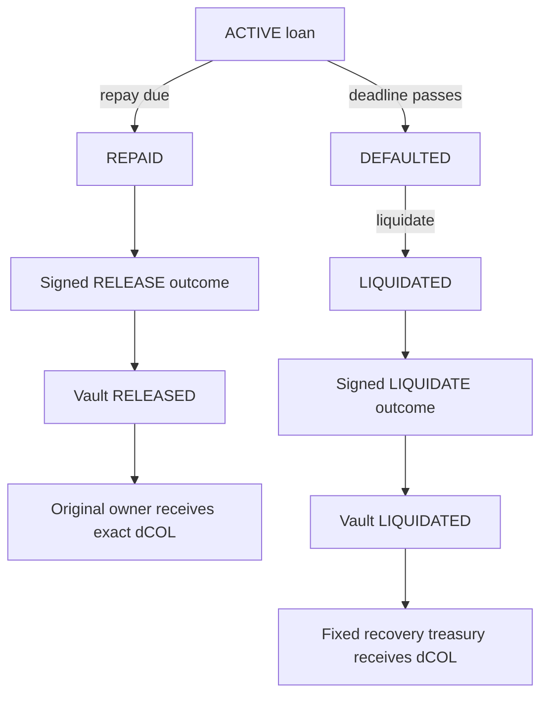

# Architecture

## Design goal

Issue liquidity on a destination chain only after the destination verifies an authenticated commitment to collateral custody on a source chain. The original asset remains in the source vault until an authenticated, terminal loan outcome returns.

## Components

### `CollateralVault` — Chain A

- Supports one configured ERC-20 collateral asset.
- Uses a per-owner monotonic lock nonce and deterministic global collateral ID.
- Transfers and measures the exact token balance delta, rejecting fee-on-transfer behavior.
- Stores owner, token, amount, requested principal, nonce, timestamps, linked loan, and state.
- Emits the exact ABI payload the relayer must attest.
- Has a one-time remote pool configuration.
- Accepts only its configured messenger and the configured remote domain/pool.
- Releases only to the stored original owner and liquidates only to the fixed recovery recipient.
- Exposes no cancellation/unilateral withdrawal for a live or potentially in-flight lock.

### `LendingPool` — Chain B

- Supports reusable trusted vault routes keyed by source domain and vault.
- Recomputes the collateral ID rather than trusting the signed value alone.
- Independently checks lock action, fields, embedded timestamps, LTV, message ID, and source nonce.
- Atomically consumes message and collateral before transferring loan tokens.
- Stores the source route needed to return each outcome.
- Accrues optional linear interest and exposes `amountDue`.
- Separates permissionless post-deadline `markDefaulted` from `liquidate`.

### `SignedRelayerMessenger`

- EIP-712 domain: name `DatabaesCrossChainMessenger`, version `1`, destination EVM `chainId`, destination messenger `verifyingContract`.
- Verifies an EOA or ERC-1271 signer through OpenZeppelin `SignatureChecker`.
- Recomputes `payloadHash`.
- Checks destination logical domain, receiver code, time window, exact next peer nonce, and message ID replay.
- Marks delivery state before calling the receiver; an application revert atomically rolls all changes back.
- Lets anyone submit a valid signature, so transaction submission is not another trusted role.

### `LocalMockMessenger`

- Implements the same application-facing adapter interface.
- Replaces cryptographic proof with an authorized local deliverer.
- Retains destination, hash, expiry, nonce, and replay checks.
- Used for isolated adapter tests/fallback only; never presented as cross-chain cryptographic security.

## Wire format

```solidity
struct Envelope {
  uint64 sourceChainId;
  uint64 destinationChainId;
  address sourceSender;
  address destinationReceiver;
  uint64 nonce;
  bytes32 payloadHash;
  uint64 createdAt;
  uint64 validUntil;
}
```

The message ID is `_hashTypedDataV4(keccak256(abi.encode(ENVELOPE_TYPEHASH, ...)))`. Consequently, a proof is unique to the destination EVM chain and deployed messenger even if all envelope fields match elsewhere.

```solidity
struct LockMessage {
  Action action; // LOCK
  bytes32 collateralId;
  address borrower;
  address collateralAsset;
  uint256 collateralAmount;
  uint256 requestedPrincipal;
  uint64 lockNonce;
  uint64 createdAt;
  uint64 validUntil;
}
```

```solidity
struct OutcomeMessage {
  Action action; // PLEDGE_CONFIRMED | RELEASE | LIQUIDATE
  bytes32 collateralId;
  uint256 loanId;
  address borrower;
  address collateralAsset;
  uint256 collateralAmount;
  uint64 lockNonce;
}
```

The vault rechecks every outcome field against stored lock state. A signed payload cannot substitute the owner, asset, amount, nonce, or loan ID.

## Successful issuance sequence

```mermaid
sequenceDiagram
    autonumber
    participant User
    participant Vault as Vault (A)
    participant Relayer
    participant MsgB as Messenger (B)
    participant Pool as Pool (B)
    participant MsgA as Messenger (A)
    User->>Vault: lockCollateral(amount, principal, expiry)
    Vault->>Vault: transfer original dCOL; state=LOCKED
    Vault-->>Relayer: OutboundMessagePrepared(LOCK, nonce=1)
    Relayer->>Relayer: wait finality; sign typed envelope
    Relayer->>MsgB: deliver(envelope, payload, signature)
    MsgB->>MsgB: route + hash + time + replay + nonce + signature
    MsgB->>Pool: receiveMessage(authenticated metadata, payload)
    Pool->>Pool: source + inner expiry + ID + LTV + collateralUsed
    Pool->>Pool: state=ACTIVE; collateralUsed=true
    Pool->>User: transfer dUSD principal
    Pool-->>Relayer: OutboundMessagePrepared(PLEDGE_CONFIRMED, nonce=1)
    Relayer->>MsgA: deliver signed acknowledgement
    MsgA->>Vault: authenticated receiveMessage
    Vault->>Vault: state=PLEDGED; original dCOL remains held
```

## Repayment and recovery sequences



State is changed before token transfers/outbound event emission. A revert unwinds the entire transaction. `REPAID` cannot become `DEFAULTED`; `LIQUIDATED` cannot be repaid.

## Replay and freshness layers

| Layer                     | State/check                              | Stops                                      |
| ------------------------- | ---------------------------------------- | ------------------------------------------ |
| EIP-712 domain            | destination EVM chain + messenger        | reuse on another deployment/network        |
| Envelope routing          | source/destination domains and contracts | wrong lane/receiver                        |
| Envelope hash             | `payloadHash`                            | payload substitution                       |
| Messenger time            | created/expiry window                    | delayed or future delivery                 |
| Messenger ID              | `processedMessage`                       | exact proof/duplicate replay               |
| Messenger nonce           | exact `latest + 1` per source            | stale/skipped/out-of-order state           |
| Receiver caller/source    | configured messenger and peer            | direct/unauthorized source calls           |
| Receiver ID/nonce         | independent mappings                     | adapter bug/alternate duplicate path       |
| Pool lock time            | embedded creation/expiry                 | refreshed outer envelope around stale lock |
| Pool collateral           | permanent `collateralUsed`               | a second signed message for the same lock  |
| Vault stored fields/state | exact outcome match and state machine    | duplicate/conflicting terminal transfer    |

## Asynchrony and races

### Lock versus cancellation

The prototype intentionally has no borrower cancellation. If cancellation existed based only on a local timeout, an already finalized proof could race to Chain B after collateral was withdrawn. Removing cancellation makes safety simple: the asset stays locked until Chain B returns a terminal result. A production cancellation design needs a cross-chain negative acknowledgement, a challenge/finality period, and route liveness assumptions.

### Ordered outcomes

The pool emits `PLEDGE_CONFIRMED` before `RELEASE` or `LIQUIDATE`. Chain A enforces exact source order, so a terminal message cannot overtake the pledge acknowledgement. If message N is missing, N+1 waits; this is a deliberate liveness-for-safety tradeoff.

### Finality

The signer—not the contracts—observes source finality. Local mode uses one block. Public recommendations start at 12 confirmations and should be adjusted to network reorg behavior. Signing an event before adequate finality may attest state later removed by a reorg.

### Duplicate delivery

An identical signed envelope reverts before dispatch. A new signed envelope containing an already-applied terminal payload reaches the vault state machine and reverts without transferring tokens. Both are harmless and tested.

## Adapter migration

Application contracts authenticate `msg.sender == messenger` and consume normalized source metadata. A future CCIP adapter would:

1. accept calls only from the CCIP router;
2. decode and validate the CCIP source selector and sender;
3. normalize them to the logical domain/address arguments;
4. retain message-ID replay protection; and
5. call the same `ICrossChainReceiver` interface.

For an immutable deployment, swapping adapters requires redeploying the application. The code separation—not upgradeability—is the hackathon goal.
