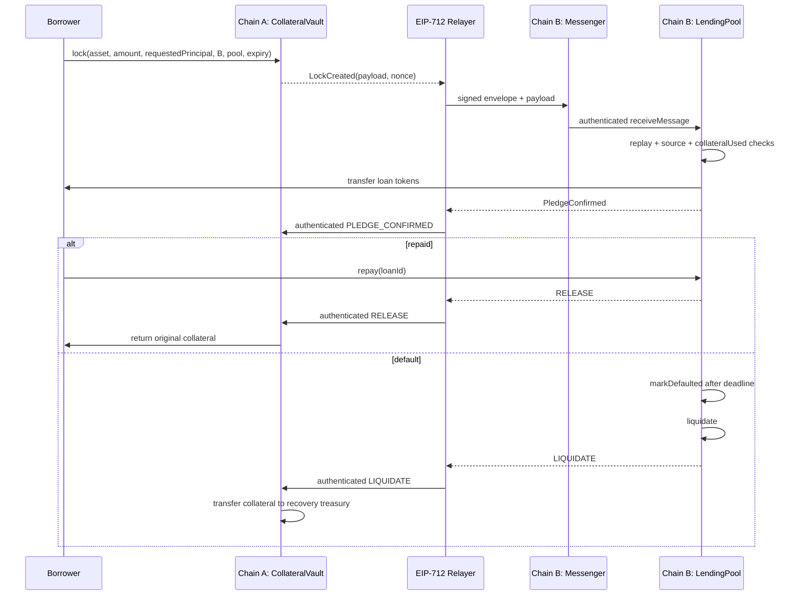

# Databaes Cross-Chain Lending — Execution Plan

**Problem:** ONE HACK W3A-3 — borrow on another blockchain without moving the asset  
**Team:** Databaes, BML Munjal University  
**Target duration:** 8 hours  
**Status:** Complete — mandatory implementation, tests, local fallback, public Sepolia/Base deployment and lifecycle, browser-verified UI, scripts, and documentation

## 0. Delivery checklist

- [x] Inspect the workspace and choose the smallest reliable toolchain.
- [x] Define architecture, trust model, invariants, state machines, payloads, tests, deployment, demo, risks, schedule, ownership, and acceptance evidence.
- [x] Phase 1 — Hardhat/TypeScript foundation, lint/format/test config, `.env.example`.
- [x] Phase 2 — Tokens, vault, pool, signed and local messenger adapters, full lifecycle (compiled; lifecycle verification is Phase 3).
- [x] Phase 3 — Unit and end-to-end adversarial tests; 21 passing, 95.65% statements / 90.43% lines on 2026-09-11.
- [x] Phase 4 — EIP-712 adapter, relayer, Sepolia/Base deployments, peer configuration, and confirmed public lifecycle.
- [x] Phase 5 — React/Vite judge dashboard; production build verified.
- [x] Phase 6 — Architecture, security, deployment, README, and deterministic demo docs.

## 1. Architecture overview

The protocol keeps an ERC-20 collateral token in `CollateralVault` on Chain A. The vault emits a domain-bound lock event. A relayer waits for the configured Chain-A finality, builds an EIP-712 envelope around the exact event payload, signs it, and submits it to `SignedRelayerMessenger` on Chain B. The messenger verifies the signature, domains, payload hash, expiry, replay status, and ordered source nonce before dispatching to `LendingPool`. The pool independently verifies the source chain/vault and prevents a collateral ID from ever issuing twice before transferring loan tokens to the borrower.

`LendingPool` emits ordered outcome messages (`PLEDGE_CONFIRMED`, `RELEASE`, or `LIQUIDATE`). The relayer signs and delivers those to the Chain-A messenger. `CollateralVault` accepts messages only from its configured messenger and configured Chain-B pool. A release pays the original borrower; a liquidation pays the configured recovery treasury. The collateral ERC-20 is never bridged, wrapped, or represented on Chain B.



## 2. Chains and domains

| Role                 | Public target    | Chain ID | Local fallback      |
| -------------------- | ---------------- | -------: | ------------------- |
| Chain A / collateral | Ethereum Sepolia | 11155111 | local node A, 31337 |
| Chain B / lending    | Base Sepolia     |    84532 | local node B, 31338 |

Sepolia and Base Sepolia have familiar explorers, EVM tooling, and inexpensive test assets. The signed envelope uses explicit logical source/destination chain IDs, so contracts and tests are not coupled to these two networks. Public deployment is conditional on testnet ETH and reachable RPC endpoints; the two-local-chain demo remains authoritative and deterministic.

## 3. Cross-chain mechanism decision

| Mechanism              | Security model                          | 8-hour strengths                                                                 | 8-hour risks                                                               | Decision                       |
| ---------------------- | --------------------------------------- | -------------------------------------------------------------------------------- | -------------------------------------------------------------------------- | ------------------------------ |
| Chainlink CCIP         | Chainlink DON + risk-management network | Production-grade routing and source authentication                               | Supported lane/token/faucet/config uncertainty; asynchronous demo delays   | Adapter-compatible future path |
| LayerZero              | Endpoint + DVN/executor configuration   | Flexible omnichain messaging                                                     | Configuration and fee funding; testnet endpoint churn                      | Not primary                    |
| Axelar GMP             | Axelar validator network + gateway      | Simple generalized messaging                                                     | Testnet gas service and finality dependencies                              | Not primary                    |
| EIP-712 signed relayer | Explicit trusted signer                 | Minimal contracts, deterministic local/public operation, exact domain separation | Signer may censor or forge messages; key operations are our responsibility | **Selected**                   |

The selected mechanism is sufficient for the hackathon because Chain B does not trust an API response: it verifies an ECDSA signature on a typed, domain-separated commitment to a finalized Chain-A event. The receiving contracts then apply independent on-chain replay, nonce, source, expiry, and state checks. It is **not trustless**. Production evolution should use a signer quorum/HSM or replace the adapter with CCIP without changing the vault/pool state machines.

## 4. Trust, finality, and security assumptions

- The configured relayer signer is honest and keeps its key secret. A compromised signer can attest a nonexistent lock, forge a release/liquidation outcome, or censor delivery. It cannot bypass receiver state-machine, replay, source, destination, expiry, or double-pledge checks, but it can fabricate data satisfying those fields. This is the main trust assumption.
- The relayer waits a configurable confirmation count (demo: 1 locally; public recommendation: 12 Sepolia blocks and appropriate Base Sepolia finality) before signing. Reorg risk before that threshold is accepted.
- Chain A and Chain B consensus, RPC correctness, token behavior, and deployed configuration are trusted.
- Tokens are standard ERC-20s; fee-on-transfer/rebasing tokens are out of scope. The vault verifies its actual received amount to reject such behavior.
- The deployer correctly configures peer chain, peer contract, messenger, treasury, LTV, and duration. Production should use multisig-controlled configuration; hackathon contracts avoid upgradeability.
- Relayer availability affects liveness, not the contracts' replay safety. A recovery runbook can re-submit an identical signed envelope; duplicate delivery is idempotently rejected.

## 5. Explicit protocol invariants

1. `collateralId = keccak256(sourceDomain, vault, asset, owner, amount, lockNonce)` is globally unique for the supported EVM domain namespace.
2. One `collateralId` creates at most one loan; `collateralUsed` is set before token transfer and never cleared.
3. Both messenger and receiver retain processed message IDs.
4. An exact envelope/message ID cannot dispatch twice, and a second envelope for the same collateral cannot create another loan.
5. The signed envelope commits to source/destination chain, source/destination contract, payload hash, ordered nonce, creation time, and expiry. The lock payload commits to borrower, asset, amount, requested principal, collateral ID, lock nonce, and lock times.
6. Delivery after `validUntil`, before `createdAt`, or with an excessive clock skew reverts on-chain.
7. Per `(sourceDomain, sourceSender)` incoming nonces must equal `latestNonce + 1`; app state versions/lock nonces are monotonic.
8. Receivers accept only the configured messenger, source domain, and peer contract.
9. The vault exposes no borrower withdrawal path for `LOCKED`/`PLEDGED` collateral; only an authenticated terminal outcome can transfer it.
10. `REPAID` and `LIQUIDATED` are disjoint terminal loan states.
11. Duplicate repayment/liquidation envelopes cannot transfer collateral twice.
12. State changes precede external calls; token operations use `SafeERC20`; entry points use reentrancy protection; privileged configuration is access controlled.
13. UI checks improve clarity only; every security boundary is a contract check.

## 6. Contract responsibilities

### Chain A

- `MockCollateralToken`: faucet-style test ERC-20; never deployed as a representation on Chain B.
- `CollateralVault`: custody, globally unique IDs, lock state machine, outbound lock payload/events, authenticated pledge/release/liquidation handling.
- `SignedRelayerMessenger`: EIP-712 envelope verification and dispatch.
- `LocalMockMessenger`: deterministic authorized-deliverer adapter for isolated tests/fallback.

### Chain B

- `MockLoanToken`: faucet/minter test stablecoin; pool inventory is pre-funded.
- `LendingPool`: authenticated lock ingestion, LTV and term checks, loan issuance, collateral-use guard, repayment, default, liquidation, and outcome events.
- The same messenger adapter implementations, configured for the Chain-B domain.

### Off-chain

- `scripts/relayer.ts`: observes finalized events, reconstructs payloads, signs typed envelopes, and submits them. It stores no authoritative protocol state; chain mappings are authoritative.
- Deploy/configure/demo scripts: deterministic local flow and optional public testnet flow.

## 7. State machines and authorization

### Collateral

```text
NONE --lock(borrower)--> LOCKED
LOCKED --authenticated pledge(pool)--> PLEDGED
PLEDGED --authenticated repayment(pool)--> RELEASED
PLEDGED --authenticated liquidation(pool)--> LIQUIDATED
```

Only the collateral owner can create the lock. There is deliberately no unilateral cancellation while a lock proof could be in flight. Only the configured messenger can call the receiver, and its message must identify the configured remote pool. Terminal transfers use the owner recorded at lock time or the immutable/configured recovery treasury; arbitrary recipients in relayed payloads are rejected.

### Loan

```text
NONE --authenticated lock(vault)--> ACTIVE
ACTIVE --repay(borrower or helper)--> REPAID
ACTIVE --markDefaulted(anyone after deadline)--> DEFAULTED
DEFAULTED --liquidate(anyone)--> LIQUIDATED
```

Issuance is only through the configured messenger. Anyone may repay on behalf of the borrower. Default and liquidation are permissionless after the fixed deadline so recovery cannot be censored by an owner. The recovery recipient is configured, not chosen by the liquidator.

## 8. Payload schemas

The envelope is signed using EIP-712 with domain `{name: "DatabaesCrossChainMessenger", version: "1", chainId: destination EVM chain ID, verifyingContract: destination messenger}`:

```solidity
Envelope {
  uint64 sourceChainId;
  uint64 destinationChainId;
  address sourceSender;
  address destinationReceiver;
  uint64 nonce;
  bytes32 payloadHash;
  uint64 createdAt;
  uint64 validUntil;
}
messageId = _hashTypedDataV4(hashStruct(envelope))
```

`LockMessage` encoded in `payload`:

```solidity
uint8 action = LOCK;
bytes32 collateralId;
address borrower;
address collateralAsset;
uint256 collateralAmount;
uint256 requestedPrincipal;
uint64 lockNonce;
uint64 createdAt;
uint64 validUntil;
```

`OutcomeMessage` encoded in `payload`:

```solidity
uint8 action = PLEDGE_CONFIRMED | RELEASE | LIQUIDATE;
bytes32 collateralId;
uint256 loanId;
address borrower;
address collateralAsset;
uint256 collateralAmount;
uint64 lockNonce;
```

The envelope binds every payload byte to the expected source/destination domain and contracts. `CollateralVault` rechecks outcome fields against immutable lock storage; `LendingPool` rechecks the lock payload and configured peer.

## 9. Double-pledge prevention

- Chain A increments a per-owner lock nonce and derives a unique collateral ID from the full lock identity.
- Chain B checks `collateralUsed[collateralId] == false`, `loanByCollateral[collateralId] == 0`, and `processedMessage[messageId] == false`.
- It marks the message and collateral used and creates the loan before transferring funds.
- `collateralUsed` is never cleared. A borrower may use returned tokens only by creating a new lock with a new nonce/ID; an old proof can never become valid again.
- The messenger independently consumes `messageId` and increments the exact next inbound nonce before receiver dispatch. A transaction revert rolls both changes back atomically.
- A signer-produced second envelope with a new message nonce but the same lock payload still reverts `CollateralAlreadyUsed` in the pool.

This is entirely on-chain. No frontend, relayer database, or indexer is an authority.

## 10. Stale-proof prevention

- Both envelope and embedded lock payload have `createdAt` and `validUntil`.
- Messenger rejects expired/not-yet-valid envelopes and verifies `payloadHash`.
- Pool rejects an expired or internally inconsistent lock payload even if the outer envelope is valid.
- Incoming message nonce must be exactly the stored peer nonce plus one, rejecting older or skipped state.
- The unique lock nonce is stored in the collateral record and echoed/rechecked in every outcome.
- Source/destination chain and contract binding prevents a valid proof for another route from being replayed here.

## 11. Repayment and liquidation flows

### Repayment

1. Compute `amountDue` (principal plus configured interest; initial reliable configuration may use zero APR).
2. Transfer due loan tokens from payer to the pool.
3. Set loan `REPAID`, then emit an ordered `RELEASE` outbound event.
4. Relayer signs/delivers that event to Chain A.
5. Vault rechecks peer, action, loan/lock identity, and `PLEDGED` state, sets `RELEASED`, then transfers the exact locked amount to the original borrower.

### Default and recovery

1. After `deadline`, anyone calls `markDefaulted`; before-deadline calls revert.
2. Anyone calls `liquidate` for a `DEFAULTED` loan. Pool sets `LIQUIDATED` before emitting the outcome.
3. Relayer signs/delivers `LIQUIDATE` to Chain A.
4. Vault rechecks the complete recorded lock, sets `LIQUIDATED`, and transfers collateral to the configured recovery treasury.
5. Repeated/default/release calls fail against terminal state; repayment and liquidation cannot both succeed.

## 12. Repository structure

```text
.
├── contracts/
│   ├── interfaces/ICrossChainMessenger.sol
│   ├── interfaces/ICrossChainReceiver.sol
│   ├── libraries/CrossChainTypes.sol
│   ├── messaging/SignedRelayerMessenger.sol
│   ├── messaging/LocalMockMessenger.sol
│   ├── mocks/MockCollateralToken.sol
│   ├── mocks/MockLoanToken.sol
│   ├── CollateralVault.sol
│   └── LendingPool.sol
├── test/                       # unit, security, lifecycle, adapter tests
├── scripts/                    # deploy, relay, local demo, attack demo
├── frontend/                   # Vite + React + ethers judge dashboard
├── deployments/               # address JSON only, never secrets
├── hardhat.config.ts
├── .env.example
├── README.md
├── PLAN.md
├── ARCHITECTURE.md
├── SECURITY.md
├── DEMO.md
└── DEPLOYMENTS.md
```

## 13. Testing strategy

- Unit-test token custody, unique IDs, permissions, state transitions, deadlines, events, and amount boundaries.
- Exercise `SignedRelayerMessenger` with real EIP-712 signatures from a test wallet; also test signer rotation/access if supported.
- Simulate two logical chain domains in one deterministic Hardhat EVM for fast atomic test setup. Run two-node scripts for judge-facing integration to demonstrate different RPC networks.
- Happy paths: lock -> issue -> pledge -> repay -> release; lock -> issue -> pledge -> expire -> default -> liquidate -> recovery.
- Required adversarial cases: same collateral/new envelope, exact proof replay, duplicate messenger delivery, expired outer proof, expired inner lock, invalid/old/skipped nonce, wrong source domain, wrong source contract, wrong destination domain/contract, unauthorized direct receiver call, altered payload, wrong signer, before-deadline default, invalid recovery action, duplicate terminal delivery, repay after default/liquidation, liquidation before default.
- Boundary cases: zero collateral/principal, principal over LTV, deadlines at `block.timestamp`, maximum sensible values, non-standard received amount rejection.
- Run compiler, full test suite, coverage if time permits, frontend typecheck/build, and deterministic demo script. Copy actual command summaries into README/DEMO; never invent output.

## 14. Deployment strategy

1. Local: start two Hardhat nodes with chain IDs 31337/31338; deploy vault/token/messenger to A and pool/token/messenger to B; configure peers; fund borrower and pool; start relayer; execute demo.
2. Public: use `SEPOLIA_RPC_URL` and `BASE_SEPOLIA_RPC_URL`, a test-only deployer, test-only attestor, and funded testnet accounts. Deploy Chain A and B independently, configure immutable/owner-gated peers, verify source code, and save addresses/transaction hashes to `deployments/*.json`.
3. Never request or spend mainnet funds. Testnet deployment will only run when RPC URLs, disposable keys, and faucet ETH are provided. Missing funding falls back to the complete local two-chain demo.
4. For a production-grade follow-up, deploy a CCIP adapter implementing the same receiver boundary and migrate from one signer to quorum/DON authentication.

## 15. Frontend screens and user flow

A single responsive application separates the judge/user experience into Overview, Open a loan, and Security evidence:

- Header: wallet connection, selected address, current chain, Sepolia/Base Sepolia switching guidance.
- Chain A card: collateral token balance/allowance, amount and requested loan inputs, approval, lock action, vault balance, collateral ID, lock nonce/state, explorer link.
- Message rail: emitted -> finality wait -> signed -> delivered, with envelope/message IDs and plain-English authenticity checks.
- Chain B card: pool liquidity, active loan principal/due/deadline/state, repay, mark-default, liquidate, explorer links.
- Security lab: “Attempt Double Pledge” and “Attempt Stale Proof,” showing the sent transaction/call and decoded on-chain custom error rather than a UI-only warning.
- Recovery card: terminal outcome, Chain-A delivery, borrower/treasury balance delta, and a persistent statement that no collateral token exists on Chain B.
- A local demo mode reads deployment JSON and lets the operator run the deterministic CLI when wallets/testnets are unreliable.

## 16. Judge-facing live demo sequence

1. Show borrower collateral balance and zero vault balance on Chain A; show no collateral-token deployment/balance on Chain B.
2. Approve and lock collateral; capture `collateralId`, nonce, and `LockCreated` event.
3. Show the typed envelope fields and relayer signature/recovered signer.
4. Deliver on Chain B and show loan-token balance increase and `ACTIVE` loan.
5. Show vault token balance is unchanged and collateral remains `PLEDGED` on Chain A.
6. Submit a newly signed delivery for the same collateral and show `CollateralAlreadyUsed`.
7. Resubmit the exact envelope and show `MessageAlreadyProcessed`; submit an expired envelope and show `MessageExpired`.
8. Advance local Chain-B time past deadline; call `markDefaulted`, then `liquidate`.
9. Relay recovery to Chain A and show treasury collateral increase, vault decrease, and `LIQUIDATED` state.
10. In a second prepared lock, show repay -> release to demonstrate the safe alternative terminal path.
11. Explain in under one minute: EIP-712 signer trust/finality, explicit routing, ordered nonces, two-layer replay defense, permanent collateral-use mapping, and adapter migration path.

## 17. Risk register and fallbacks

| Risk                             | Impact                          | Mitigation                                                   | Demo fallback                                           |
| -------------------------------- | ------------------------------- | ------------------------------------------------------------ | ------------------------------------------------------- |
| Testnet RPC/faucet unavailable   | Cannot deploy or relay publicly | Two providers per chain; prepare early                       | Two local chain IDs with identical contracts/signatures |
| Cross-chain confirmation latency | Dead air during demo            | Pre-deploy/pre-fund; show event lifecycle                    | Deterministic manual relay script                       |
| Relayer key compromise           | Forged lock/outcome possible    | Disclose trust; disposable key; signer quorum/HSM roadmap    | No production-value claims                              |
| Relayer offline/censors          | Messages delayed                | Events are replayable; anyone can submit signed envelope     | Manual `relay` command                                  |
| Reorg before attestation         | Invalid lock could be attested  | Confirmation threshold and block/hash logging                | Local finalized blocks                                  |
| Nonce gap/out-of-order outcome   | Later message waits             | Relayer processes each peer sequentially                     | Deliver pledge before terminal outcome                  |
| Token decimal/price mismatch     | Unsafe LTV                      | Demo assets both 18 decimals and assumed $1; enforce max LTV | Fixed mock pair only                                    |
| Frontend wallet/network friction | Demo interruption               | Clear switching/error states                                 | CLI prints same events and reverts                      |
| Dependency install failure       | Build blocked                   | Pin minimal packages, avoid unnecessary SDKs                 | Use cached npm tooling if available                     |
| Eight-hour scope pressure        | Unfinished polish               | Mandatory contracts/tests/CLI first                          | Defer oracle/health-factor/CCIP UI polish               |

## 18. Eight-hour schedule

| Hour | Milestone                                     | Exit criterion                                                  |
| ---: | --------------------------------------------- | --------------------------------------------------------------- |
|  0–1 | Architecture, invariants, repo/tooling        | Plan reviewed; compiler runs                                    |
|  1–2 | Types, messenger, mock tokens, vault          | Lock and authenticated receive compile                          |
|  2–3 | Pool, issuance, replay/double-pledge          | Loan issued; attacks revert                                     |
|  3–4 | Repay/default/liquidate/recovery              | Both terminal paths work in tests                               |
|  4–5 | Adversarial and integration test matrix       | Mandatory tests green with actual output                        |
|  5–6 | Deployment + relayer + two-node demo scripts  | Reproducible local demo; public deploy attempted only if funded |
|  6–7 | Frontend judge dashboard                      | Build passes; lifecycle/security states visible                 |
|  7–8 | Docs, rehearsal, transaction evidence, buffer | Demo under 5 minutes; acceptance matrix green                   |

## 19. Four-person work allocation

| Member         | Primary ownership                                                     | Integration responsibility                        |
| -------------- | --------------------------------------------------------------------- | ------------------------------------------------- |
| Shivang Tanwar | Architecture lead; `CollateralVault`, `LendingPool`, invariant review | Final contract review and demo narration          |
| Chahat Singh   | EIP-712/local messenger adapters; relayer and deployment scripts      | Public testnet configuration and message evidence |
| Aniket Mishra  | Unit/integration/adversarial tests; coverage and attack scripts       | Own acceptance matrix and reproduce all reverts   |
| Punya Mahajan  | React dashboard, wallet/network UX, explorer/status rendering         | CLI fallback, README/DEMO visuals, rehearsal      |

Pairing checkpoints happen at hours 2, 4, 6, and 7. No component is considered integrated until Aniket's tests exercise it and Punya can expose its evidence. Secrets stay only in ignored local `.env` files.

## 20. Acceptance-criteria matrix

| Mandatory requirement              | Contract implementation                                                          | Automated test                                                   | Frontend/CLI demonstration                             | Documentation evidence                   |
| ---------------------------------- | -------------------------------------------------------------------------------- | ---------------------------------------------------------------- | ------------------------------------------------------ | ---------------------------------------- |
| 1. Lock A, loan B from proof       | `CollateralVault.lockCollateral`; signed messenger; `LendingPool.receiveMessage` | Successful issue lifecycle                                       | Two chain cards + relayer step                         | README sequence + architecture diagram   |
| 2. Choose and justify verification | `SignedRelayerMessenger` EIP-712 recovery                                        | Valid signature succeeds; wrong signer fails                     | Display typed envelope/recovered signer                | PLAN §3–4; ARCHITECTURE trust model      |
| 3. Prevent double pledge           | `collateralUsed`; `loanByCollateral`                                             | Same collateral/new valid envelope reverts                       | “Attempt Double Pledge” decoded revert                 | SECURITY invariant and evidence table    |
| 4. Enforce on-chain                | Pool mappings/checks before transfer                                             | Direct transaction proves revert independent of UI               | CLI submits actual transaction/call                    | Source links and test command            |
| 5. Reject stale state/proof        | envelope + inner expiry; exact nonce; lock nonce                                 | Expired outer/inner and old/skipped nonce revert                 | “Attempt Stale Proof”                                  | SECURITY freshness section               |
| 6. Replay/source protection        | messenger + receiver processed IDs; source/destination/peer checks               | exact replay, duplicate, wrong chain/contract/destination/signer | Security lab shows custom errors                       | Payload schema + threat table            |
| 7. Repayment and safe release      | `repay`; `RELEASE`; vault terminal transfer                                      | Full repay/release; duplicate harmless/rejected                  | Repay and borrower balance delta                       | DEMO repayment path                      |
| 8. Default/liquidation/recovery    | `markDefaulted`; `liquidate`; `LIQUIDATE`; treasury transfer                     | early default fails; full recovery; unauthorized/invalid fails   | Advance time, default, liquidate, relay, balance delta | DEMO recovery path + state diagram       |
| 9. Successful cross-chain loan     | Complete contracts/adapters                                                      | End-to-end signed lifecycle                                      | Main happy-path timeline                               | Actual local/public transaction evidence |
| 10. Visible rejected attack        | Custom errors and mappings                                                       | double-use + exact/expired replay tests                          | Actual decoded revert panel/CLI                        | DEMO exact commands and expected errors  |

## 21. Scope gates

Mandatory correctness, tests, local two-chain demo, and documentation are the release gate. Public testnet addresses/hashes are recorded only after real confirmed transactions. Bonus multi-chain configuration and interest are included only when they do not weaken the core. Oracle liquidation and a production CCIP adapter remain stretch goals after every row above has executable evidence.
