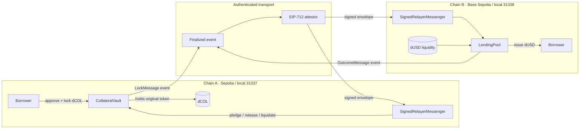

# Databaes Cross-Chain Lending

> Borrow on Chain B against collateral that remains locked on Chain A—without bridging, wrapping, or minting a collateral representation.

Built by **Databaes** (Shivang Tanwar, Chahat Singh, Aniket Mishra, and Punya Mahajan) from BML Munjal University for ONE HACK, problem W3A-3.

**Live testnet app:** https://onehack.shivang.me · **Source:** https://github.com/shivangtanwar/onehack

**Submission materials:** [submission/SUBMISSION.md](submission/SUBMISSION.md). **Hosting and relay operations:** [ops/README.md](ops/README.md).

**Verified on 2026-09-13:** 21 contract tests and 20 browser/wallet tests pass; Solidity lint, TypeScript checks, and the production build pass. The loan page offers separate buttons to add and select Ethereum Sepolia and Base Sepolia. Mainnet IDs are rejected.

**Team onboarding:** start with the zero-Web3-prerequisite Part I of [TEAM_ARCHITECTURE_GUIDE.md](./TEAM_ARCHITECTURE_GUIDE.md), then use Part II only when contract-level detail is needed.

## What works

- Native ERC-20 collateral custody in `CollateralVault` on Chain A.
- Loan-token issuance from `LendingPool` on Chain B after an EIP-712 signed lock attestation.
- Two independent on-chain replay barriers plus permanent `collateralUsed[collateralId]` enforcement.
- Outer-envelope expiry, embedded lock expiry, exact ordered peer nonces, and unique lock nonces.
- Expected messenger, source chain, source vault, destination chain, and destination receiver checks.
- Repay -> authenticated release to the original borrower.
- Deadline -> default -> liquidation -> authenticated recovery to a fixed treasury.
- Configurable LTV and linear interest accrual (demo defaults: 50% LTV, 0% APR).
- Signed production-style adapter plus a deterministic local mock adapter.
- A two-node local deployment/demo script and a guided, responsive React application with overview, loan, and security-evidence views.
- **Actual result:** full local and public Sepolia/Base lifecycles plus mined attack-rejection demos passed on 2026-09-11; `21 passing` Hardhat tests; 95.65% statement / 90.43% line coverage; frontend production build and browser visual QA passed.

## Architecture



The collateral token is only deployed and transferred on Chain A. Chain B stores metadata about the lock; it does not deploy a wrapper or mint a representation of the collateral.

### Message verification choice

We selected a custom signed relayer using EIP-712 because it is the smallest mechanism that can be operated deterministically across two local chains and two public EVM testnets within an eight-hour event. The receiver verifies a real ECDSA/ERC-1271-compatible typed signature, not an API response. Every signature commits to:

- source and destination chain/domain IDs;
- source application and destination receiver;
- the hash of all application payload bytes;
- the exact next source nonce;
- creation and expiry timestamps; and
- the destination EVM chain and messenger contract through the EIP-712 domain.

This is **federated, not trustless**. The configured signer can censor delivery or fabricate a source event. A compromised signer can therefore create fraudulent loans or terminal outcomes if it supplies internally consistent fields. It still cannot make one collateral ID issue twice, reuse a consumed message, skip a nonce, redirect an existing signature, or transfer collateral twice because those checks are independent contract state. The production path is a signer quorum/HSM or an `ICrossChainMessenger` CCIP adapter.

See [ARCHITECTURE.md](./ARCHITECTURE.md) for the full protocol and [SECURITY.md](./SECURITY.md) for assumptions and threats.

## State machines

```text
Collateral: NONE -> LOCKED -> PLEDGED -> RELEASED
                                      \-> LIQUIDATED

Loan:       NONE -> ACTIVE -> REPAID
                          \-> DEFAULTED -> LIQUIDATED
```

- The owner can create a lock but cannot unilaterally withdraw while a proof may be in flight.
- Only the configured messenger can confirm a pledge or terminal outcome.
- Anyone can repay an active loan.
- Anyone can mark it defaulted after its deadline and liquidate a defaulted loan.
- The liquidation recipient is fixed in the vault; a liquidator cannot redirect collateral.

## The double-pledge invariant

The ID is computed on both chains as:

```solidity
keccak256(abi.encode(
  sourceChainId,
  sourceVault,
  collateralAsset,
  owner,
  amount,
  lockNonce
));
```

Issuance atomically sets:

```solidity
processedMessage[messageId] = true;
latestRemoteNonce[sourceChainId][sourceVault] = sourceNonce;
collateralUsed[collateralId] = true;
loanByCollateral[collateralId] = loanId;
```

`collateralUsed` is never cleared. Returned collateral must be locked again with a new monotonic lock nonce and therefore a new ID. Exact replay fails in the messenger; a second validly signed envelope for the same lock reaches the pool and fails `CollateralAlreadyUsed`.

## Repository map

```text
contracts/             Vault, pool, wire types, interfaces, adapters, mock tokens
test/                  Lifecycle, signed security, and local adapter tests
scripts/               Deploy, configure, one-shot relay, deterministic demo
frontend/              Vite + React loan workspace
deployments/           Generated address/transaction metadata (local files ignored)
PLAN.md                Execution plan, schedule, ownership, acceptance matrix
ARCHITECTURE.md         Components, schemas, sequence and race analysis
TEAM_ARCHITECTURE_GUIDE.md  In-depth team briefing, contract internals, flows, security, and judge Q&A
SECURITY.md             Invariants, trust model, threat table, limitations
DEMO.md                 Short judge-facing live demo
DEPLOYMENTS.md          Local/public network configuration and evidence
```

## Prerequisites

- Node.js 20 or 22 (verified with 22.22.2)
- npm 10+
- Two terminal windows for the local two-chain demo
- Optional: MetaMask or another EIP-1193 wallet for the dashboard

## Install and verify

```bash
npm ci
npm --prefix frontend ci
npm run compile
npm test
npm run lint:sol
npx tsc --noEmit
npm run frontend:build
```

Verified results on 2026-09-11:

```text
Compiled 36 Solidity files successfully (evm target: paris).
21 passing (3s)
Coverage: 95.65% statements, 90.43% lines, 90.63% functions
Solhint: exit 0
Root TypeScript: exit 0
Vite: 176 modules transformed; production build succeeded
```

The exact test names are in `test/lifecycle.spec.ts`, `test/security.spec.ts`, and `test/local-messenger.spec.ts`. Timing varies by machine.

## Deterministic two-chain demo

Start the nodes in separate terminals:

```bash
npm run node:a
npm run node:b
```

In a third terminal:

```bash
npm run deploy:a
npm run deploy:b
npm run configure:a
npm run configure:b
npm run demo:local
```

The script prints actual transaction hashes, balances, state changes, `MessageAlreadyProcessed`, `CollateralAlreadyUsed`, `MessageExpired`, and the liquidation recovery delta. It also writes the first signed proof to ignored `frontend/public/local-demo-evidence.json` for the UI security lab.

Run the dashboard:

```bash
cp frontend/.env.example frontend/.env
npm run frontend:dev
```

Open `http://127.0.0.1:5173`, connect a wallet loaded with a local Hardhat account, and add/switch between RPC ports 8545 and 9545. The app reads the tracked position and available security evidence automatically.

See [DEMO.md](./DEMO.md) for the five-minute judge script and recovery/reset instructions.

## Public testnet deployment

Targets:

| Role       | Network          | Chain ID | Explorer                     |
| ---------- | ---------------- | -------: | ---------------------------- |
| Collateral | Ethereum Sepolia | 11155111 | https://sepolia.etherscan.io |
| Lending    | Base Sepolia     |    84532 | https://sepolia.basescan.org |

| Contract          | Ethereum Sepolia                                       | Base Sepolia                                           |
| ----------------- | ------------------------------------------------------ | ------------------------------------------------------ |
| Native demo token | `dCOL` at `0xF11dfC764Ac5526E7D690183fAEFDFfF0DC74868` | `dUSD` at `0x4D1aE7eBcfE1bEdc3c5aFb592871d8B3ec76bA52` |
| Signed messenger  | `0x3BA4CADeD1F5A98e5A88728e9CF4218091A754d3`           | `0xF11dfC764Ac5526E7D690183fAEFDFfF0DC74868`           |
| Application       | Vault `0xd5b4a096de2d668Db01eab08D76c11a563b38Bf3`     | Pool `0x3d38c71541ED82c313EBEBFdAb20a0CDEbb76770`      |

Copy `.env.example` to `.env` and provide disposable, faucet-funded testnet credentials. Never use a mainnet key.

```bash
bash scripts/hardhat.sh run scripts/deploy-chain-a.ts --network sepolia
bash scripts/hardhat.sh run scripts/deploy-chain-b.ts --network baseSepolia

CHAIN_A_DEPLOYMENT_FILE=sepolia.json CHAIN_B_DEPLOYMENT_FILE=baseSepolia.json \
  bash scripts/hardhat.sh run scripts/configure-chain-a.ts --network sepolia
CHAIN_A_DEPLOYMENT_FILE=sepolia.json CHAIN_B_DEPLOYMENT_FILE=baseSepolia.json \
  bash scripts/hardhat.sh run scripts/configure-chain-b.ts --network baseSepolia
```

Relay one finalized event with `npm run relayer`; required variables are documented in [DEPLOYMENTS.md](./DEPLOYMENTS.md). The relayer verifies the source transaction, confirmation count, emitted source address, destination domain, configured trusted signer, and destination receipt before reporting success.

Ethereum Sepolia Chain A and Base Sepolia Chain B are deployed, mutually configured, and proven through a complete public loan/default/recovery lifecycle with 12 source confirmations. See [DEPLOYMENTS.md](./DEPLOYMENTS.md) and `deployments/public-demo.json` for explorer-linked evidence.

The production frontend defaults to these public contracts and preloads the completed public collateral ID. `frontend/public/public-security-evidence.json` contains the exact signed envelope for each recorded replay, double-pledge, and stale-proof transaction. To deliberately execute another testnet lifecycle and overwrite evidence:

```bash
PUBLIC_DEMO_ALLOW_REPEAT=true npm run demo:public
```

## Frontend flow

The dashboard is organized around everyday borrowing and loan management. See [frontend/README.md](./frontend/README.md) for setup, persistence, event-history indexing, and browser tests.

1. **Overview** summarizes collateral, outstanding balances, open loans, and the next repayment. Connecting a wallet discovers its loans and displays its balances; the disconnected public workspace is clearly identified.
2. **My loans** supports status filters, search, named loans, and tracking an existing collateral ID. Details include the deadline, time remaining, collateral location, and a repayment review.
3. **New loan** guides the borrower through amounts, contract terms, a review, collateral approval, and the final lock. The resulting loan opens directly in its progress view.
4. **Activity & history** lists confirmed events across both networks, with search, filters, pagination, CSV export, and explorer links.
5. **Safety & contracts** explains custody, documents the relay dependency, lists all six contract addresses, and preserves inspectable public security evidence.

The frontend distinguishes a confirmed repayment from a completed collateral return, and a liquidated loan from completed collateral recovery. It reads contract state every 12 seconds; cross-chain delivery is handled by the background relay worker described in `ops/README.md`. Names and watchlists are saved per wallet and deployment in this browser.


## Known limitations

- One attestor is a trusted federation point and a key-compromise risk.
- The linear LTV assumes both 18-decimal mock assets have the same unit price. No oracle is used.
- Strict peer nonces prioritize safety and simple stale-state reasoning over out-of-order delivery; a missing message blocks later messages for that peer until delivered.
- There is no cancellation for a lock whose proof was never relayed, avoiding the unsafe “cancel racing an in-flight proof” problem. A production version needs a cross-chain negative acknowledgement/challenge window.
- Mock token faucets are intentionally unrestricted and must never secure real value.
- Peer configuration is owner-controlled; the vault peer is one-time, while the pool can support multiple trusted vaults.
- All six current public contracts have Sourcify exact-match verification for both creation and runtime bytecode.

## Future improvements

- Replace the single attestor with CCIP or an M-of-N signer quorum using HSM-backed keys.
- Add oracle-normalized collateral valuation, health factors, partial repayment, and incentive-aware liquidations.
- Add a safe unpledged-lock cancellation protocol with finality and challenge periods.
- Add per-route rate limits, circuit breakers, multisig ownership, and emergency pause limited to new issuance.
- Index events for richer message-finality status without making the indexer authoritative.
- Add explorer-native verification metadata and richer indexed message-finality links to deployment JSON.

## Safety

This is hackathon/testnet software and is not audited. Do not deposit assets with real value. Never place keys in source files, screenshots, shell transcripts, deployment JSON, or commits. `.env`, generated local evidence, and the pre-existing workspace token directories are ignored.

## License

MIT (hackathon prototype).
