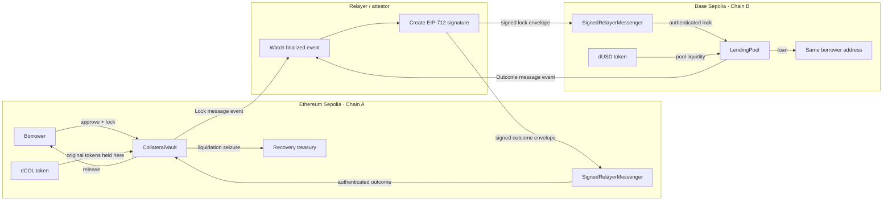
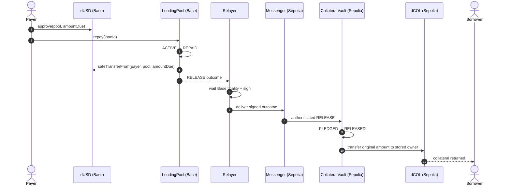
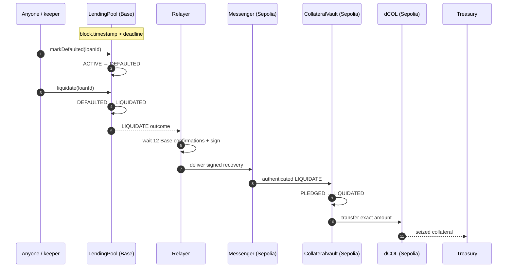
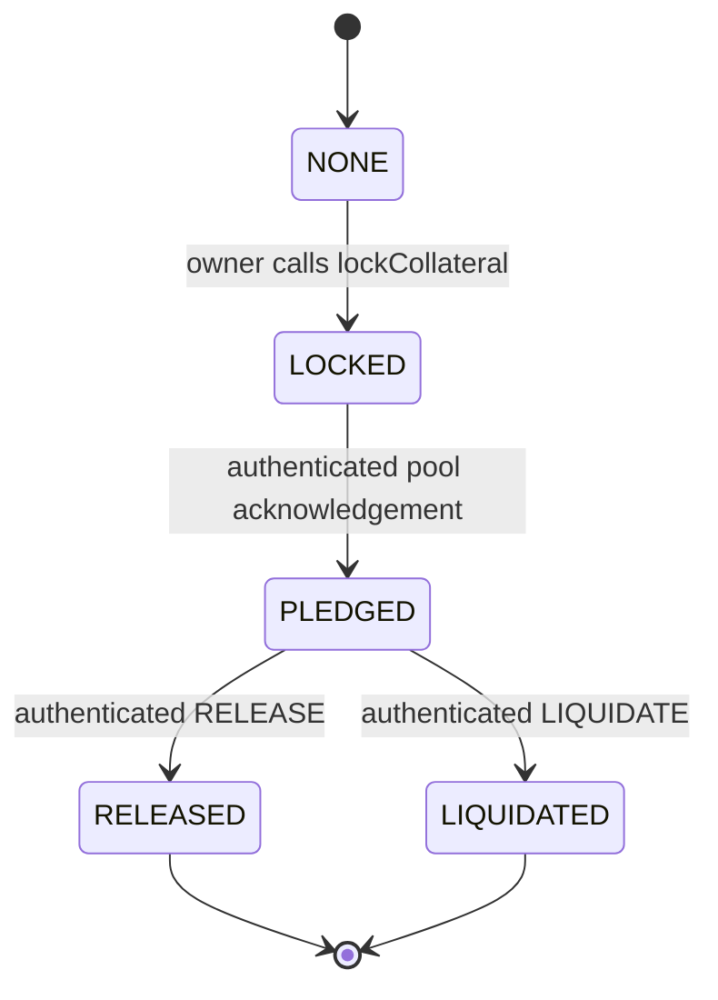
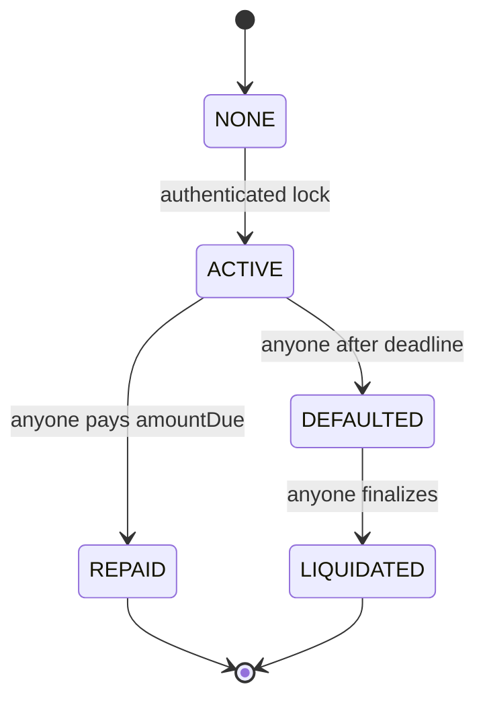

# Databaes Cross-Chain Lending: Team Architecture Guide

This document explains how the complete system works, why each contract exists, how the two blockchains communicate, what is enforced on-chain, and what assumptions the team must disclose to judges.

It describes the implementation currently deployed on Ethereum Sepolia and Base Sepolia. It now starts from zero blockchain knowledge and gradually moves into the exact contract implementation.

## How to use this guide

There are two reading tracks:

- **Beginner track:** Read Part I first. It explains the product using ordinary language and one consistent analogy. This is enough to understand the demo and answer common judge questions.
- **Technical track:** Continue into Part II when you want the exact structs, mappings, validation order, security assumptions, scripts, or contract behavior.

Do not try to memorize the Solidity code. First understand the story of what moves, what does not move, and which component is allowed to make each decision.

# Part I — Blockchain and the project from zero

## A. The 60-second version

Imagine that a customer owns gold in Delhi but wants a loan from a bank in Mumbai.

The gold should remain in a secure Delhi locker. The Mumbai bank should lend only after receiving a trustworthy, tamper-evident confirmation that:

- the gold is actually locked;
- the locker belongs to this customer;
- the confirmation is fresh;
- the confirmation was meant for this exact bank; and
- this gold has not already been used for another loan.

Our system does the blockchain version of that process:

| Analogy                           | Project component                     |
| --------------------------------- | ------------------------------------- |
| Delhi locker                      | `CollateralVault` on Ethereum Sepolia |
| Gold                              | dCOL collateral token                 |
| Mumbai bank                       | `LendingPool` on Base Sepolia         |
| Loan money                        | dUSD loan token                       |
| Signed courier letter             | EIP-712 cross-chain message           |
| Security desk checking the letter | `SignedRelayerMessenger`              |
| Unique locker receipt number      | `collateralId`                        |
| Trusted courier/notary            | Relayer attestor                      |
| Bank’s “already used” register    | `collateralUsed[collateralId]`        |

The gold/dCOL never travels to Mumbai/Base. Only signed information travels.

## B. What is a blockchain?

A blockchain is a shared database run by many computers.

Instead of one company privately editing the database, transactions are grouped into blocks and accepted by the network. Once a block is sufficiently confirmed, changing it becomes difficult.

For this project, think of each blockchain as an independent public computer:

- Ethereum Sepolia is one computer/database.
- Base Sepolia is another computer/database.
- Each has its own contracts, balances, blocks, and transaction history.
- A contract on one chain cannot directly read the other chain.

Both networks are **testnets**. Their ETH and tokens are for testing and have no intended real-world value.

## C. Essential Web3 words

### Wallet

A wallet manages a private key. The private key proves that the wallet owner authorized a transaction.

The wallet does not literally hold tokens inside an app. Token contracts store balances associated with the wallet’s public address.

### Address

An address is a public identifier such as:

```text
0xA72E96C5e3397195722017629DB9C325A99b28d3
```

Wallets and smart contracts both have addresses.

### Private key

A private key is the secret used to sign transactions. Anyone who obtains it can control that wallet.

Private keys are never included in this repository, documentation, deployment JSON, or frontend. They remain in the ignored `.env` file.

### Transaction

A transaction is a signed instruction sent to a blockchain. Examples include:

- approve the vault to transfer dCOL;
- lock collateral;
- deliver a signed cross-chain message;
- repay a loan; or
- liquidate a defaulted loan.

A successful transaction has receipt status `1`. A reverted transaction has status `0` and changes no contract state.

### Gas

Gas is the computation fee paid in the chain’s native currency. Sepolia ETH pays Ethereum Sepolia gas; Base Sepolia ETH pays Base Sepolia gas.

Gas is not the loan token and not the collateral token.

### Smart contract

A smart contract is code and persistent storage deployed at a blockchain address.

Once a transaction calls a contract, every network node executes the same rules. The frontend cannot override those rules.

### Token and ERC-20

An ERC-20 contract is a standard ledger of fungible token balances.

This project uses:

- `dCOL` as test collateral on Ethereum Sepolia; and
- `dUSD` as test loan liquidity on Base Sepolia.

Both have 18 decimal places. Their faucet-style `mint` functions are for testnets only.

### Approval

An ERC-20 approval gives another contract permission to transfer up to a specified amount.

Approval does not move tokens. The later `lockCollateral` call performs the actual transfer into the vault.

### Block and confirmation

A block is a batch of accepted transactions.

Waiting 12 confirmations means waiting until 11 additional blocks have been added after the transaction’s block. This reduces the risk of signing an event that disappears during a chain reorganization.

### Event

An event is a structured log emitted by a contract. Off-chain programs can observe it efficiently.

The vault and pool emit `OutboundMessagePrepared` events to say, “Here is the exact message that may be delivered to the other chain.”

### Hash

A hash is a fixed-size fingerprint of data.

```text
different input data → different hash
same input data      → same hash
```

The signed envelope contains `keccak256(payload)`. If one byte of the payload changes, the hash changes and validation fails.

### Digital signature

A digital signature proves that a particular private key signed particular data.

The destination messenger recovers/checks the configured attestor from the EIP-712 signature. Changing a signed chain, address, nonce, timestamp, or payload hash invalidates it.

### Nonce

Nonce means “number used once.” This project has two different nonce ideas:

- a **lock nonce** makes each borrower deposit unique; and
- a **message nonce** forces cross-chain messages to arrive in order.

Think of message nonces like numbered courier envelopes: envelope 2 is not accepted before envelope 1.

### Finality

Finality is confidence that an accepted transaction will not be removed by a reorganization.

Our relayer waits 12 source-chain confirmations before signing public messages.

### Bridge

A token bridge normally locks/burns an asset on one chain and creates/releases a representation on another.

This project is deliberately not a bridge. No dCOL representation is created on Base.

### Loan-to-value (LTV)

LTV describes how large a loan may be compared with its collateral.

```text
LTV = loan amount ÷ collateral value × 100
```

The demo maximum is 50%. With the demo’s equal-unit price assumption, locking 100 dCOL permits at most 50 dUSD.

### EIP-712

EIP-712 is a standard way to sign structured data with named fields and a domain. The domain includes the destination chain and messenger contract, so a signature created for one deployment cannot simply be reused on another.

## D. Why the two contracts cannot call each other directly

Ethereum Sepolia and Base Sepolia maintain separate state.

The Base lending pool cannot execute code such as:

```text
ask Ethereum Sepolia vault whether collateral is locked
```

The EVM has no native instruction for reading an unrelated chain.

That is why the architecture needs a message:

1. Chain A creates authoritative state.
2. An observer waits for finality.
3. The observer signs a statement about that state.
4. Chain B verifies the signature and statement.
5. Chain B applies its own rules before changing state.

The reverse process communicates repayment or liquidation back to Chain A.

## E. The five main characters

### 1. Borrower

The borrower owns dCOL on Ethereum Sepolia and wants dUSD on Base Sepolia.

The same public wallet address can exist on both chains, but its balances are separate on each chain.

### 2. CollateralVault — the locker

The vault:

- receives the original dCOL;
- assigns a unique `collateralId`;
- remembers owner, amount, requested loan, nonce, and state;
- emits the lock message;
- refuses local withdrawal while a remote loan may exist; and
- later releases or seizes collateral only after an authenticated outcome.

### 3. LendingPool — the bank

The pool:

- holds dUSD liquidity;
- receives authenticated lock information;
- checks the source and proof freshness;
- checks the maximum loan size;
- permanently records that the collateral ID was used;
- transfers dUSD to the borrower; and
- manages repayment, default, and liquidation.

### 4. SignedRelayerMessenger — the security desk

Each chain has its own messenger.

The messenger does not decide financial policy. It checks whether a cross-chain letter is authentic, fresh, correctly addressed, and in order before handing it to the vault or pool.

### 5. Relayer/attestor — the courier and notary

The relayer watches source events, waits for confirmations, signs the message, and submits it on the destination chain.

The relayer is trusted for remote-event truth. It is not a decentralized bridge and must not be described as trustless.

## F. What moves and what does not

| Item                          | Moves across chains?    | What actually happens?                                                             |
| ----------------------------- | ----------------------- | ---------------------------------------------------------------------------------- |
| Original dCOL                 | **No**                  | Moves only from borrower to Sepolia vault, then to borrower or treasury on Sepolia |
| dUSD                          | **No bridge movement**  | Existing Base pool liquidity transfers locally to the borrower on Base             |
| Lock information              | **Yes, as signed data** | Encoded payload is signed and submitted to Base                                    |
| Repayment/liquidation outcome | **Yes, as signed data** | Encoded outcome is signed and submitted to Sepolia                                 |
| Frontend state                | No authority            | Reads both chains and displays contract state                                      |

This distinction is the entire problem statement: value stays native to its chain, while authenticated information coordinates the two state machines.

## G. The successful borrowing journey in simple language

### Step 1: Get test collateral

The borrower receives dCOL on Ethereum Sepolia. This is a test faucet token.

### Step 2: Approve the vault

The borrower sends an ERC-20 approval transaction.

Meaning: “Vault, you may transfer up to 100 dCOL when I ask you to lock it.”

No dCOL has moved yet.

### Step 3: Lock the dCOL

The borrower calls:

```text
lockCollateral(100 dCOL, request 50 dUSD, expiry)
```

The vault transfers 100 dCOL from the borrower into itself and stores the lock as `LOCKED`.

### Step 4: Create a unique receipt

The vault computes `collateralId` using:

- source chain;
- vault address;
- token address;
- borrower;
- amount; and
- borrower’s next lock nonce.

This is like a unique tamper-resistant locker receipt.

### Step 5: Emit a lock message

The vault emits an event containing the borrower, token, amount, requested loan, unique ID, nonce, creation time, and expiry.

### Step 6: Wait for source finality

The relayer waits 12 Ethereum Sepolia confirmations. It does not immediately trust a newly mined block.

### Step 7: Sign the message

The attestor signs an EIP-712 envelope containing:

- Sepolia source chain ID;
- Base destination chain ID;
- Sepolia vault address;
- Base lending pool address;
- exact payload hash;
- ordered message nonce;
- creation time; and
- expiry time.

### Step 8: Deliver to Base

Anyone may pay Base gas to submit the signed envelope, payload, and signature to the Base messenger.

The messenger behaves like a security desk checking the sealed courier package.

### Step 9: Check the loan rules

The Base lending pool receives the authenticated message and checks:

- the messenger is genuine;
- source chain and vault are trusted;
- proof and lock have not expired;
- message nonce is correct;
- collateral ID is correctly calculated;
- this collateral ID has never been used; and
- 50 dUSD is within the 50% LTV limit for 100 dCOL.

### Step 10: Issue dUSD

The pool permanently marks the collateral ID as used, creates an `ACTIVE` loan, and transfers 50 dUSD to the borrower on Base.

### Step 11: Confirm the pledge back on Sepolia

The pool emits `PLEDGE_CONFIRMED`. After Base finality, the relayer signs and delivers it to the Sepolia messenger.

The vault changes `LOCKED → PLEDGED` and records the Base loan ID.

The 100 dCOL never leaves the Sepolia vault during this process.

## H. Repayment in simple language

If the borrower repays:

1. A payer approves the Base pool to collect the required dUSD.
2. The payer calls `repay(loanId)`.
3. The Base pool changes `ACTIVE → REPAID` and collects dUSD.
4. The pool emits a `RELEASE` outcome.
5. The relayer waits for Base finality and signs the outcome.
6. The Sepolia messenger verifies it.
7. The vault checks that this is the same borrower, asset, amount, lock nonce, and loan ID.
8. The vault changes `PLEDGED → RELEASED`.
9. The vault transfers the original dCOL back to the stored borrower.

The loan cannot later be liquidated because `REPAID` is a terminal state.

## I. Default and liquidation in simple language

If the borrower does not repay before the deadline:

1. Anyone may call `markDefaulted` after the deadline.
2. The pool changes `ACTIVE → DEFAULTED`.
3. Anyone may call `liquidate`.
4. The pool changes `DEFAULTED → LIQUIDATED` before creating the recovery message.
5. The relayer waits for Base finality and signs `LIQUIDATE`.
6. The Sepolia messenger verifies the message.
7. The vault verifies all stored lock fields and loan ID.
8. The vault changes `PLEDGED → LIQUIDATED`.
9. The original dCOL transfers to the fixed recovery treasury.

The liquidator cannot type in a recipient address. The treasury was fixed when the vault was deployed.

## J. How double borrowing is stopped

Think of three security gates.

### Gate 1: Has this exact signed letter already been delivered?

The messenger stores every processed `messageId`.

An exact replay fails with:

```text
MessageAlreadyProcessed
```

### Gate 2: Is this the next numbered letter?

Messages must have the exact next nonce. Old, skipped, and out-of-order messages fail.

### Gate 3: Has this locker receipt already funded any loan?

The pool permanently stores:

```text
collateralUsed[collateralId] = true
```

Even if the trusted signer produces a brand-new correctly signed envelope with a new message ID and nonce, the same collateral ID fails:

```text
CollateralAlreadyUsed
```

This third gate is the central hackathon requirement. It is on-chain and does not depend on the frontend or a database.

## K. How stale and wrongly addressed messages are stopped

A valid cross-chain message is not merely “signed.” It must also be correctly addressed and fresh.

The messenger checks:

- destination chain;
- destination contract;
- exact payload hash;
- creation and expiry times;
- message ID reuse;
- next nonce; and
- trusted signer.

The application then checks:

- expected messenger caller;
- expected source chain;
- expected source contract;
- embedded lock expiry;
- matching stored state; and
- legal state transition.

Examples:

| Attack                                  | Rejection                 |
| --------------------------------------- | ------------------------- |
| Submit same proof twice                 | `MessageAlreadyProcessed` |
| Reuse same collateral with new envelope | `CollateralAlreadyUsed`   |
| Submit after expiry                     | `MessageExpired`          |
| Claim another vault                     | `UnauthorizedSource`      |
| Change amount inside payload            | `InvalidPayloadHash`      |
| Skip message number                     | `InvalidNonce`            |

## L. What the signature does—and does not—prove

The signature proves:

> “The configured attestor signed this exact message for this exact destination messenger and chain.”

It does not independently prove that Ethereum consensus produced the source event. The system trusts the attestor to observe the correct finalized event.

Therefore, the correct description is:

```text
EIP-712 signed relayer attestation with explicit signer trust
```

The incorrect description is:

```text
trustless bridge or trustless cryptographic light-client proof
```

If the attestor is compromised, it can lie about remote events. This is the largest security limitation and should be stated confidently rather than hidden.

## M. Why the frontend is not security

The frontend is a dashboard and transaction builder.

It helps users:

- connect a wallet;
- switch networks;
- choose amounts;
- understand LTV;
- track the lifecycle;
- see transaction links; and
- read decoded errors.

An attacker can ignore the frontend and call a contract directly. That is why every important rule is in Solidity.

If frontend JavaScript is modified, the contract still rejects invalid amounts, proofs, sources, nonces, replays, double pledges, and illegal state changes.

## N. What each team member should remember

### Shivang — contract and architecture explanation

Remember:

- dCOL stays in the Sepolia vault.
- Base receives signed information, not the asset.
- the pool permanently consumes `collateralId`;
- repayment and liquidation are separate terminal paths; and
- the signer model is federated, not trustless.

### Chahat — messaging and relayer explanation

Remember:

- the relayer watches `OutboundMessagePrepared`;
- it waits 12 confirmations;
- EIP-712 binds both chains, both contracts, nonce, timestamps, and payload hash;
- destination messenger checks the signature and ordering; and
- anyone may submit a valid signature, but only the trusted key may create one.

### Aniket — security and testing explanation

Remember:

- exact replay is stopped by `processedMessage`;
- new-message double pledge is stopped by `collateralUsed`;
- stale inner and outer timestamps are both checked;
- wrong source chain/contract and wrong signer tests exist; and
- public attack transactions have status 0.

### Punya — frontend and demo explanation

Remember:

- Overview shows the tracked cross-chain lifecycle;
- Open a loan guides connect → approve → lock;
- Security evidence links real failed transactions;
- frontend warnings are for UX only; and
- explorer/state data comes directly from deployed contracts.

## O. Beginner-friendly public demo story

Use this order rather than starting with code:

1. **Show the two networks.** “Sepolia holds collateral; Base lends dUSD.”
2. **Show the borrower’s 100 dCOL.** “This is the asset we refuse to bridge.”
3. **Show the lock transaction.** “The dCOL moved only into the Sepolia vault.”
4. **Show the signed message.** “After 12 confirmations, the attestor signed the exact lock details.”
5. **Show the Base loan.** “The pool independently checked the proof and sent 50 dUSD.”
6. **Show vault custody.** “The same 100 dCOL was still in the Sepolia vault.”
7. **Show failed double pledge.** “A new valid envelope still failed because the collateral ID was already consumed.”
8. **Show default and liquidation.** “The Base loan became liquidated first.”
9. **Show recovery.** “Only then did an authenticated reverse message seize the original dCOL for the treasury.”
10. **Disclose trust.** “One attestor is trusted; production would replace it with CCIP or a signer quorum.”

## P. Common beginner questions

### “If the collateral does not move, how does Base know it exists?”

Base knows through a signed attestation about the finalized Sepolia lock event. It trusts the configured attestor and then applies additional on-chain checks.

### “Does the messenger hold any tokens?”

No. The messenger verifies and dispatches data. The vault holds dCOL; the pool holds dUSD.

### “Why are there two messenger contracts?”

Each blockchain has separate state. Base needs a local messenger for incoming lock proofs; Sepolia needs a local messenger for incoming loan outcomes.

### “Why send pledge confirmation back?”

It links the Chain-A lock to the actual Chain-B loan ID and moves the collateral state from `LOCKED` to `PLEDGED` before any terminal release or liquidation outcome.

### “Why can anyone repay or liquidate?”

The financial conditions matter, not the caller identity. Anyone may help repay; anyone may execute overdue recovery. The contracts determine the recipient and legal state.

### “What if the relayer sends the same message twice?”

The second transaction reverts. The message ID is already stored as processed.

### “What if the signer makes a new message for the same collateral?”

The pool still rejects it because the collateral ID is permanently marked used.

### “What if the relayer goes offline?”

No incorrect loan is created, but progress pauses. Signed messages can be resubmitted; an unsigned pending event requires the attestor to return. Liveness is different from safety.

### “Can test dCOL or dUSD be treated as real money?”

No. Their mint functions are intentionally open. They exist only to demonstrate protocol logic.

## Q. What to memorize before presenting

Every teammate should be able to say these six sentences:

1. The original collateral always remains on Ethereum Sepolia until release or liquidation.
2. Base Sepolia receives an EIP-712 signed statement about the finalized lock, not a bridged token.
3. The destination messenger verifies chain, contracts, payload hash, nonce, expiry, and signer.
4. The lending pool independently checks LTV and permanently consumes the collateral ID.
5. Repayment releases collateral; overdue liquidation sends it to a fixed treasury.
6. The current signer is a disclosed trust assumption and is not described as trustless.

# Part II — Contract-level technical reference

## 1. The system in one paragraph

A borrower deposits the original `dCOL` ERC-20 token into `CollateralVault` on Ethereum Sepolia. The vault never sends that token to Base. Instead, it emits a structured lock message. After waiting for Sepolia finality, an explicitly trusted relayer signs an EIP-712 commitment to that message and submits it to `SignedRelayerMessenger` on Base Sepolia. The messenger authenticates the signature, source, destination, payload hash, nonce, and timestamps before calling `LendingPool`. The pool independently validates the lock, permanently marks the `collateralId` as used, and transfers `dUSD` liquidity to the borrower. Repayment or liquidation later produces a signed outcome in the reverse direction. Only that authenticated outcome can make the Sepolia vault return the collateral to the borrower or seize it for the recovery treasury.

## 2. The mental model

There are three distinct layers:

1. **Application layer:** `CollateralVault` and `LendingPool` own the financial state machines.
2. **Messaging layer:** `SignedRelayerMessenger` authenticates and orders cross-chain messages.
3. **Transport/operator layer:** the TypeScript relayer watches finalized events, signs them, and pays to submit them to the other chain.

The transport is not the security database. Every authoritative decision is made by contracts.



### What “cross-chain syncing” means here

The contracts do not call each other directly across chains. An EVM contract can only read its own chain.

Cross-chain synchronization is an authenticated event-delivery process:

```text
Source contract changes state
        ↓
Source contract emits OutboundMessagePrepared
        ↓
Relayer waits for configured block confirmations
        ↓
Relayer signs an EIP-712 envelope containing keccak256(payload)
        ↓
Anyone may submit envelope + payload + signature on destination chain
        ↓
Destination messenger verifies proof and ordering
        ↓
Destination application independently verifies source and protocol state
        ↓
Destination state changes atomically
```

This is authenticated messaging, not token bridging. The only item crossing chains is signed information.

## 3. Current public deployment

### Ethereum Sepolia — collateral chain

| Component                      | Address                                                                                                                         | Purpose                                                  |
| ------------------------------ | ------------------------------------------------------------------------------------------------------------------------------- | -------------------------------------------------------- |
| `MockCollateralToken` (`dCOL`) | [`0xF11dfC764Ac5526E7D690183fAEFDFfF0DC74868`](https://sepolia.etherscan.io/address/0xF11dfC764Ac5526E7D690183fAEFDFfF0DC74868) | Test collateral that exists natively on Chain A          |
| `SignedRelayerMessenger`       | [`0x3BA4CADeD1F5A98e5A88728e9CF4218091A754d3`](https://sepolia.etherscan.io/address/0x3BA4CADeD1F5A98e5A88728e9CF4218091A754d3) | Verifies Base-to-Sepolia outcome attestations            |
| `CollateralVault`              | [`0xd5b4a096de2d668Db01eab08D76c11a563b38Bf3`](https://sepolia.etherscan.io/address/0xd5b4a096de2d668Db01eab08D76c11a563b38Bf3) | Holds original collateral and enforces its state machine |

Logical domain: `11155111`.

### Base Sepolia — lending chain

| Component                | Address                                                                                                                         | Purpose                                           |
| ------------------------ | ------------------------------------------------------------------------------------------------------------------------------- | ------------------------------------------------- |
| `SignedRelayerMessenger` | [`0xF11dfC764Ac5526E7D690183fAEFDFfF0DC74868`](https://sepolia.basescan.org/address/0xF11dfC764Ac5526E7D690183fAEFDFfF0DC74868) | Verifies Sepolia-to-Base lock attestations        |
| `MockLoanToken` (`dUSD`) | [`0x4D1aE7eBcfE1bEdc3c5aFb592871d8B3ec76bA52`](https://sepolia.basescan.org/address/0x4D1aE7eBcfE1bEdc3c5aFb592871d8B3ec76bA52) | Test stablecoin-like liquidity                    |
| `LendingPool`            | [`0x3d38c71541ED82c313EBEBFdAb20a0CDEbb76770`](https://sepolia.basescan.org/address/0x3d38c71541ED82c313EBEBFdAb20a0CDEbb76770) | Issues loans and enforces repayment/default state |

Logical domain: `84532`.

The same 20-byte address may appear on two chains because contract addresses depend on deployer and nonce. It does not mean the contracts or assets are the same. Chain ID is part of their identity and is signed into every message.

### Operational roles

| Role                      | Current address                              | Authority                                            |
| ------------------------- | -------------------------------------------- | ---------------------------------------------------- |
| Deployer / contract owner | `0xA72E96C5e3397195722017629DB9C325A99b28d3` | Configures peers and may rotate the messenger signer |
| EIP-712 attestor          | `0x0Cccb788d45F8B864Faa6DA40916F1A3Fbab712F` | Signs finalized cross-chain event envelopes          |
| Recovery treasury         | `0x0Cccb788d45F8B864Faa6DA40916F1A3Fbab712F` | Receives collateral after liquidation                |
| Borrower in public demo   | `0xA72E96C5e3397195722017629DB9C325A99b28d3` | Locks dCOL and receives dUSD                         |

Using the attestor as the recovery treasury is acceptable for the testnet demonstration but should be separated in a production design.

All six current contracts have Sourcify exact-match verification for both creation and runtime bytecode.

## 4. Contract inventory

| Contract or library      | Chain      | Type                         | Responsibility                                                             |
| ------------------------ | ---------- | ---------------------------- | -------------------------------------------------------------------------- |
| `MockCollateralToken`    | A          | OpenZeppelin ERC-20          | Faucet-style dCOL used only as native source collateral                    |
| `CollateralVault`        | A          | Custody/application contract | Holds dCOL, creates unique locks, processes authenticated outcomes         |
| `SignedRelayerMessenger` | A and B    | EIP-712 adapter              | Verifies routes, proof hashes, signatures, expiry, replay, and ordering    |
| `LocalMockMessenger`     | Local only | Test adapter                 | Deterministic delivery without pretending to provide cryptographic trust   |
| `MockLoanToken`          | B          | OpenZeppelin ERC-20          | Faucet-style dUSD used as lending liquidity                                |
| `LendingPool`            | B          | Lending/application contract | Validates remote locks, prevents double pledging, issues and settles loans |
| `CrossChainTypes`        | Shared     | Solidity library             | Defines message actions and payload structures                             |
| `ICrossChainMessenger`   | Shared     | Interface                    | Keeps applications independent of a specific messaging implementation      |
| `ICrossChainReceiver`    | Shared     | Interface                    | Standard entry point for authenticated application delivery                |

## 5. Shared cross-chain data types

### Actions

```solidity
enum Action {
  INVALID,
  LOCK,
  PLEDGE_CONFIRMED,
  RELEASE,
  LIQUIDATE
}
```

`INVALID` is zero so the default value can never accidentally represent a valid transition.

### Signed routing envelope

```solidity
struct Envelope {
  uint64 sourceChainId;
  uint64 destinationChainId;
  address sourceSender;
  address destinationReceiver;
  uint64 nonce;
  bytes32 payloadHash;
  uint64 createdAt;
  uint64 validUntil;
}
```

The envelope answers four questions:

- Where did the message originate?
- Where is it allowed to execute?
- Which exact payload bytes are authorized?
- Is this the next fresh message in the permitted time window?

### Lock payload

```solidity
struct LockMessage {
  Action action;
  bytes32 collateralId;
  address borrower;
  address collateralAsset;
  uint256 collateralAmount;
  uint256 requestedPrincipal;
  uint64 lockNonce;
  uint64 createdAt;
  uint64 validUntil;
}
```

This payload contains everything Base needs to decide whether it may issue a loan. It is ABI-encoded, and its complete byte sequence is committed through `Envelope.payloadHash`.

### Outcome payload

```solidity
struct OutcomeMessage {
  Action action;
  bytes32 collateralId;
  uint256 loanId;
  address borrower;
  address collateralAsset;
  uint256 collateralAmount;
  uint64 lockNonce;
}
```

This payload tells the vault that Base created the pledge, accepted repayment, or finalized liquidation. The vault compares every field against stored Chain-A state before moving tokens.

## 6. CollateralVault in detail

`CollateralVault` is the custody authority on Chain A. It inherits:

- `ICrossChainReceiver`, so the messenger has one normalized delivery entry point;
- `Ownable`, for one-time peer configuration; and
- `ReentrancyGuard`, to stop nested token/message calls.

It uses OpenZeppelin `SafeERC20` for token transfers.

### Immutable configuration

| Field               | Meaning                                                         |
| ------------------- | --------------------------------------------------------------- |
| `collateralToken`   | The only dCOL token accepted by this vault                      |
| `messenger`         | The only local contract allowed to deliver cross-chain outcomes |
| `localChainId`      | Logical source domain, currently Sepolia `11155111`             |
| `recoveryRecipient` | Fixed address receiving collateral after liquidation            |

The constructor checks every address and checks that the messenger reports the same local domain.

### One-time peer configuration

`configurePeer(remoteChainId, remoteLendingPool)` is owner-only and may execute once.

After it executes, the vault accepts outcomes only when:

```text
sourceChainId == configured Base domain
sourceSender  == configured LendingPool
msg.sender    == configured local messenger
```

The peer cannot be swapped after locks exist. That avoids an owner redirecting active collateral to a different remote application.

### Collateral record

```solidity
struct Collateral {
  address owner;
  address asset;
  uint256 amount;
  uint256 requestedPrincipal;
  uint256 loanId;
  uint64 lockNonce;
  uint64 createdAt;
  uint64 validUntil;
  CollateralState state;
}
```

Each record contains enough data for future outcomes to be checked without trusting the relayer to repeat it correctly.

### Storage used by the vault

| Storage                       | Purpose                                              |
| ----------------------------- | ---------------------------------------------------- |
| `ownerLockNonce[owner]`       | Monotonic number used to make each owner lock unique |
| `collaterals[collateralId]`   | Authoritative collateral record and state            |
| `processedMessage[messageId]` | Application-level duplicate protection               |
| `outboundNonce`               | Ordered nonce for vault-to-pool messages             |
| `latestRemoteNonce`           | Exact next pool-to-vault state version               |

### How `collateralId` is generated

```solidity
collateralId = keccak256(
    abi.encode(
        sourceChainId,
        vaultAddress,
        collateralToken,
        owner,
        amount,
        lockNonce
    )
);
```

The source domain and vault prevent identical deposits on other chains/contracts from colliding. The owner nonce prevents the same owner, token, and amount from producing the same ID twice.

The destination pool independently recomputes this formula. A signer cannot simply invent a different ID for otherwise identical lock fields.

### `lockCollateral` execution order

The borrower supplies:

- collateral amount;
- requested dUSD principal; and
- a lock-proof expiry.

The function performs these steps atomically:

1. Require peer configuration.
2. Reject zero collateral or zero requested principal.
3. Require `validUntil > block.timestamp`.
4. Limit proof lifetime to at most one day.
5. Increment the caller’s lock nonce.
6. Compute and collision-check `collateralId`.
7. Store the record as `LOCKED`.
8. Transfer dCOL into the vault using `safeTransferFrom`.
9. Compare the vault balance before and after the transfer.
10. Reject fee-on-transfer behavior if the exact amount was not received.
11. Encode the `LockMessage`.
12. Increment `outboundNonce`.
13. Emit `CollateralLocked` and `OutboundMessagePrepared`.

If any step fails, the entire EVM transaction reverts—including token movement and stored state.

### Why the vault has no borrower withdrawal function

Suppose the borrower could withdraw after a timeout while an already-finalized lock proof was still traveling to Base. The borrower could withdraw on A and receive a loan on B moments later.

The prototype removes that race entirely: once locked, collateral can leave only through an authenticated `RELEASE` or `LIQUIDATE` outcome from the configured Base pool.

This favors safety over liveness. If the relayer permanently disappears before loan issuance, an unused lock can remain stuck. A production cancellation protocol needs a cross-chain negative acknowledgement and a challenge/finality period.

### Processing an outcome

`receiveMessage` first verifies:

1. Caller is the configured messenger.
2. Source chain and source pool are configured peers.
3. Application `messageId` has not been processed.
4. `sourceNonce == latestRemoteNonce + 1`.
5. The collateral record exists.
6. Borrower, asset, amount, and lock nonce exactly match stored data.
7. `loanId != 0`.

It then consumes the message ID and nonce before applying the action.

| Outcome            | Required current state         | State/effect                                                          |
| ------------------ | ------------------------------ | --------------------------------------------------------------------- |
| `PLEDGE_CONFIRMED` | `LOCKED`                       | Store loan ID and move to `PLEDGED`                                   |
| `RELEASE`          | `PLEDGED` and matching loan ID | Move to `RELEASED`, return exact dCOL to original owner               |
| `LIQUIDATE`        | `PLEDGED` and matching loan ID | Move to `LIQUIDATED`, transfer exact dCOL to fixed recovery recipient |

State changes occur before external token transfers. A transfer failure reverts the state change.

## 7. LendingPool in detail

`LendingPool` is the credit authority on Chain B. It never owns or transfers dCOL. It stores authenticated metadata about the remote lock and transfers only dUSD.

It inherits the same `ICrossChainReceiver`, `Ownable`, and `ReentrancyGuard` foundations and uses `SafeERC20` plus OpenZeppelin `Math.mulDiv`.

### Immutable loan configuration

| Field               |   Current public value | Meaning                                   |
| ------------------- | ---------------------: | ----------------------------------------- |
| `localChainId`      |                `84532` | Base Sepolia logical domain               |
| `loanDuration`      |          `180 seconds` | Fixed public demo term                    |
| `maxLtvBps`         |                 `5000` | Maximum 50% loan-to-value                 |
| `annualInterestBps` |                    `0` | Demo APR; formula supports nonzero values |
| `loanToken`         |           dUSD address | ERC-20 transferred to/from borrowers      |
| `messenger`         | Base messenger address | Only local message dispatcher accepted    |

### Source allowlist

```solidity
trustedVaults[sourceChainId][vault] = true;
```

The owner must explicitly allow a source domain and vault address. A valid attestor signature claiming another vault still fails `UnauthorizedSource`.

The mapping shape supports more than one remote vault, although the current deployed route uses one active Sepolia vault.

### Critical lending storage

```solidity
mapping(bytes32 => bool) collateralUsed;
mapping(bytes32 => uint256) loanByCollateral;
mapping(uint256 => Loan) loans;
mapping(bytes32 => bool) processedMessage;
```

These mappings are the central on-chain answer to double pledging.

`collateralUsed[collateralId]` is set permanently and is never cleared—even after repayment or liquidation. If returned collateral is used again, the user must make a new vault lock with a new lock nonce and a new collateral ID.

### Loan record

```solidity
struct Loan {
  bytes32 collateralId;
  address borrower;
  address collateralAsset;
  uint256 collateralAmount;
  uint256 principal;
  uint64 startTime;
  uint64 deadline;
  uint64 sourceChainId;
  address sourceVault;
  uint64 lockNonce;
  LoanState state;
}
```

The source route is retained because every later outcome must return to the exact vault and domain that supplied the lock.

### Issuing a loan from an authenticated lock

After the messenger calls `receiveMessage`, the pool performs these checks in order:

1. `msg.sender` is the configured Base messenger.
2. `(sourceChainId, sourceSender)` is a trusted vault route.
3. Application `messageId` is unused.
4. `sourceNonce` is exactly the next nonce for this source vault.
5. Payload decodes as `LockMessage` with action `LOCK`.
6. ID, borrower, asset, amounts, nonce, and time window are nonzero/valid.
7. Lock creation is not more than five minutes in the future.
8. Embedded lock proof has not expired.
9. `collateralId` matches the pool’s own recomputation.
10. `collateralUsed[collateralId]` is false.
11. Requested principal is at or below maximum LTV.
12. The final dUSD transfer must succeed; insufficient pool liquidity reverts the complete transaction.

The LTV rule is:

```text
maximumPrincipal = collateralAmount × maxLtvBps ÷ 10,000
```

For the demo:

```text
100 dCOL × 5,000 ÷ 10,000 = maximum 50 dUSD
```

After validation, the pool executes checks-effects-interactions:

1. Increment `loanCount`.
2. Consume application message ID and source nonce.
3. Set `collateralUsed[collateralId] = true`.
4. Set `loanByCollateral[collateralId] = loanId`.
5. Store an `ACTIVE` loan with its deadline.
6. Emit `LoanIssued`.
7. Transfer dUSD to the borrower.
8. Emit a `PLEDGE_CONFIRMED` outbound message for Chain A.

If the dUSD transfer fails, the complete transaction reverts, so the message and collateral ID are not accidentally consumed without a loan.

### Interest calculation

```text
interest = principal × annualInterestBps × elapsedSeconds
           ------------------------------------------------
                    10,000 × 365 days

amountDue = principal + interest
```

Public demo APR is zero. Nonzero linear interest is covered by automated tests.

### Repayment

Anyone may repay an active loan on behalf of the borrower:

1. Require loan state `ACTIVE`.
2. Calculate current `amountDue`.
3. Change state to `REPAID`.
4. Pull dUSD from the payer using `safeTransferFrom`.
5. Emit `LoanRepaid`.
6. Emit an ordered `RELEASE` message to the source vault.

The Sepolia vault later authenticates that release, changes `PLEDGED → RELEASED`, and sends the original dCOL to the stored owner.

### Default and liquidation

The recovery path is deliberately two-stage:

1. `markDefaulted(loanId)` may be called by anyone only when `block.timestamp > deadline` and state is `ACTIVE`.
2. `liquidate(loanId)` may be called by anyone only when state is `DEFAULTED`.

`liquidate` changes the loan to `LIQUIDATED` before emitting the recovery message. Chain A then authenticates `LIQUIDATE`, changes collateral to `LIQUIDATED`, and transfers dCOL to the immutable recovery recipient.

The caller cannot choose the recipient. This prevents a random liquidator from redirecting collateral.

## 8. SignedRelayerMessenger in detail

`SignedRelayerMessenger` is deployed separately on each chain. It is the cryptographic adapter, not the lending logic.

### EIP-712 domain separation

The EIP-712 domain is:

```text
name:              DatabaesCrossChainMessenger
version:           1
chainId:           destination EVM chain ID
verifyingContract: destination messenger address
```

Even if an identical envelope is signed elsewhere, it cannot be replayed through another messenger or chain because the EIP-712 digest changes.

### Envelope type hash

```text
Envelope(
  uint64 sourceChainId,
  uint64 destinationChainId,
  address sourceSender,
  address destinationReceiver,
  uint64 nonce,
  bytes32 payloadHash,
  uint64 createdAt,
  uint64 validUntil
)
```

The message ID is the final EIP-712 digest:

```text
messageId = _hashTypedDataV4(hashStruct(envelope))
```

### Delivery validation order

`deliver(envelope, payload, signature)` verifies:

1. Envelope destination logical chain equals the messenger’s `localChainId`.
2. Source chain and source sender are nonzero.
3. Destination receiver is nonzero and has deployed code.
4. `envelope.payloadHash == keccak256(payload)`.
5. `validUntil > createdAt`.
6. `createdAt` is not more than five minutes ahead of destination time.
7. Current time is not after `validUntil`.
8. EIP-712 `messageId` has not been processed.
9. Envelope nonce is exactly `latestNonce[sourceChainId][sourceSender] + 1`.
10. Signature is valid for `trustedSigner`.

OpenZeppelin `SignatureChecker` supports an EOA signer and ERC-1271 contract signers.

After checking, the messenger consumes the message and nonce and calls:

```solidity
ICrossChainReceiver(destinationReceiver).receiveMessage(
    messageId,
    sourceChainId,
    sourceSender,
    nonce,
    payload
);
```

If the application receiver reverts, the messenger’s consumed state also reverts atomically. A rejected application message cannot create a nonce gap.

### Anyone can submit a signed proof

There is no submitter allowlist. Once the trusted signer has produced a valid signature, any address may pay gas to deliver it. Therefore:

- the signer controls authenticity;
- the submitter affects liveness/gas payment only; and
- a relayer server database is not needed for double-pledge safety.

### Signer rotation

The messenger owner may rotate `trustedSigner`. This is an administrative trust power. Queued messages signed by the old key stop working immediately after rotation.

## 9. End-to-end lock and loan flow

```mermaid
sequenceDiagram
    autonumber
    actor Borrower
    participant dCOL as dCOL (Sepolia)
    participant Vault as CollateralVault (Sepolia)
    participant Relayer
    participant MsgB as Messenger (Base)
    participant Pool as LendingPool (Base)
    participant dUSD as dUSD (Base)
    participant MsgA as Messenger (Sepolia)

    Borrower->>dCOL: approve(vault, 100)
    Borrower->>Vault: lockCollateral(100, 50, expiry)
    Vault->>dCOL: safeTransferFrom(borrower, vault, 100)
    Vault->>Vault: record LOCKED + unique collateralId
    Vault-->>Relayer: OutboundMessagePrepared(LOCK, nonce, payload)
    Relayer->>Relayer: wait 12 Sepolia confirmations
    Relayer->>Relayer: sign EIP-712 envelope
    Relayer->>MsgB: deliver(envelope, payload, signature)
    MsgB->>MsgB: authenticate route/hash/time/replay/nonce/signature
    MsgB->>Pool: receiveMessage(normalized source metadata, payload)
    Pool->>Pool: source + inner expiry + ID + double-use + LTV checks
    Pool->>Pool: create ACTIVE loan; permanently consume collateralId
    Pool->>dUSD: safeTransfer(borrower, 50)
    Pool-->>Relayer: OutboundMessagePrepared(PLEDGE_CONFIRMED)
    Relayer->>Relayer: wait 12 Base confirmations
    Relayer->>MsgA: deliver signed pledge outcome
    MsgA->>Vault: authenticated receiveMessage
    Vault->>Vault: LOCKED → PLEDGED; store loanId
```

At the moment dUSD is issued, the vault still owns the full dCOL balance. The pledge acknowledgement changes metadata only; it does not transfer collateral.

## 10. Repayment and release flow



Repayment after default or liquidation fails because only `ACTIVE` can become `REPAID`.

## 11. Default, liquidation, and recovery flow



Repayment and liquidation are mutually exclusive terminal paths because the loan enum permits neither transition after the other terminal state.

## 12. State machines and authorization

### Collateral state machine



| Transition             | Who triggers it?    | Who authorizes it?                                  |
| ---------------------- | ------------------- | --------------------------------------------------- |
| `NONE → LOCKED`        | Collateral owner    | Owner’s token approval and vault checks             |
| `LOCKED → PLEDGED`     | Any proof submitter | Attestor signature, messenger, configured Base pool |
| `PLEDGED → RELEASED`   | Any proof submitter | Authenticated `RELEASE` from configured loan        |
| `PLEDGED → LIQUIDATED` | Any proof submitter | Authenticated `LIQUIDATE` from configured loan      |

### Loan state machine



| Transition               | Caller restriction        | State/time restriction                                   |
| ------------------------ | ------------------------- | -------------------------------------------------------- |
| `NONE → ACTIVE`          | Configured messenger only | Trusted vault, fresh proof, unused collateral, LTV valid |
| `ACTIVE → REPAID`        | Anyone                    | Must transfer full amount due                            |
| `ACTIVE → DEFAULTED`     | Anyone                    | Current time strictly after deadline                     |
| `DEFAULTED → LIQUIDATED` | Anyone                    | Must already be defaulted                                |

## 13. How double pledging is prevented

Double pledging is stopped at multiple independent layers.

### Layer 1: exact message replay

The messenger stores:

```solidity
processedMessage[messageId] = true;
```

Submitting the identical envelope again produces the same EIP-712 message ID and reverts `MessageAlreadyProcessed`.

### Layer 2: message ordering

The messenger and application both require the exact next nonce. An older or skipped message fails `InvalidNonce`.

### Layer 3: collateral-level uniqueness

An attacker or compromised relayer might create a second envelope with a fresh message ID and the next valid nonce while retaining the same lock payload.

The pool still checks:

```solidity
if (collateralUsed[collateralId]) {
    revert CollateralAlreadyUsed(collateralId, loanByCollateral[collateralId]);
}
```

This is the central judging invariant. The public demo includes a newly signed second envelope that passes messenger-level exact replay checks but fails the pool’s permanent collateral guard.

### Layer 4: unique future reuse

`collateralUsed` is never cleared. If collateral is released and locked again, the source vault increments `lockNonce`, producing a different collateral ID.

### Why a database is unnecessary

The relayer may remember which events it processed for convenience, but losing or corrupting that database cannot make the contracts issue a second loan. The authoritative message and collateral-use flags are on-chain.

## 14. Freshness, replay, and route protection

| Threat                                  | Contract check                           | Typical custom error                          |
| --------------------------------------- | ---------------------------------------- | --------------------------------------------- |
| Exact envelope delivered twice          | Messenger `processedMessage`             | `MessageAlreadyProcessed`                     |
| New envelope reuses same lock           | Pool `collateralUsed`                    | `CollateralAlreadyUsed`                       |
| Envelope arrives after expiry           | Messenger timestamp check                | `MessageExpired`                              |
| Fresh outer envelope wraps expired lock | Pool checks embedded lock timestamps     | `LockMessageExpired`                          |
| Envelope claims future creation time    | Five-minute skew bound                   | `MessageNotYetValid`                          |
| Old or skipped state version            | Exact next nonce                         | `InvalidNonce`                                |
| Wrong source chain or vault             | Application peer allowlist               | `UnauthorizedSource`                          |
| Wrong destination chain                 | Messenger local domain                   | `InvalidDestinationChain`                     |
| Wrong destination contract              | Signed receiver plus deployed-code check | `InvalidSignature` or receiver rejection      |
| Payload bytes changed                   | `keccak256(payload)`                     | `InvalidPayloadHash`                          |
| Wrong signer                            | EIP-712 signature recovery               | `InvalidSignature`                            |
| Forged collateral ID                    | Pool recomputes ID                       | `CollateralIdMismatch`                        |
| Illegal lifecycle transition            | Enum state check                         | `InvalidLoanState` / `InvalidCollateralState` |

## 15. Two layers of application replay state

The messenger and each application store processed IDs/nonces.

This is deliberate defense in depth:

- The messenger prevents a duplicate before dispatch.
- The receiver does not blindly assume every possible future adapter is perfect.
- Application replay protection survives an adapter implementation mistake or alternate delivery path.

During delivery, both layers update inside one EVM transaction. If the receiver rejects, every messenger update rolls back.

## 16. Nonce model

Nonces represent ordered state versions, not user transaction nonces.

| Direction        | Producer storage                              | Consumer storage                                           |
| ---------------- | --------------------------------------------- | ---------------------------------------------------------- |
| Vault A → Pool B | Vault `outboundNonce`                         | Base messenger and pool nonces keyed by source chain/vault |
| Pool B → Vault A | Pool `outboundNonce[destinationChain][vault]` | Sepolia messenger and vault latest remote nonce            |

The required rule is:

```text
incoming nonce == stored latest nonce + 1
```

Benefits:

- old messages cannot roll state backward;
- skipped messages cannot make a receiver miss a required transition; and
- pledge confirmation must precede release/liquidation.

Tradeoff: a missing message blocks later messages in that stream until the missing one is delivered.

## 17. Finality and asynchronous timing

The contract can validate timestamps and ordering, but it cannot know whether another chain’s block is finalized.

The relayer therefore waits a configured confirmation count before signing:

- Public lock demo: 12 Ethereum Sepolia confirmations.
- Public pledge and recovery outcomes: 12 Base Sepolia confirmations.
- Local fallback: deterministic local blocks.

Finality is part of the attestor’s trust policy. Signing too early could authenticate an event removed by a source-chain reorganization.

### Clock skew

The messenger and pool permit a message creation time up to five minutes ahead of the destination block timestamp. This tolerates small cross-chain clock differences while rejecting implausible future messages.

### Expiry

- Lock-proof expiry is chosen at lock time and capped at one day.
- Outcome envelopes are valid for one day.
- Delivery after expiry reverts on-chain.

## 18. The relayer and off-chain infrastructure

The relayer is a TypeScript process using Ethers v6.

### Its responsibilities

1. Connect to source and destination RPCs.
2. Find `OutboundMessagePrepared` from the expected source application.
3. Wait for the configured source confirmation count.
4. Read the source application’s logical domain.
5. Reconstruct the exact envelope.
6. Hash the emitted payload bytes.
7. Verify event destination matches the destination RPC chain.
8. Sign EIP-712 with the configured attestor key.
9. Confirm that the destination messenger trusts that signer.
10. Submit `deliver` and require a successful receipt.

### What the relayer cannot legitimately decide

The relayer does not decide:

- whether collateral was already used;
- whether LTV is acceptable;
- whether a loan is active or terminal;
- whether a source vault is trusted;
- whether a proof is stale; or
- where collateral should be released or seized.

Those decisions are repeated and enforced by contracts.

### Important trust limitation

The attestor is not trustless and must never be described as a light client or decentralized bridge.

A compromised attestor can:

- sign a nonexistent lock and create an unbacked loan;
- sign a matching fraudulent release/liquidation outcome;
- delay or censor delivery.

Even a compromised attestor cannot use valid contract execution to:

- issue two loans from the same collateral ID;
- process the same message ID twice;
- redirect an already-signed message to another chain/messenger/receiver;
- change signed payload bytes;
- skip the enforced nonce; or
- transfer the same collateral record twice.

Production improvement: replace one signer with an M-of-N/HSM quorum or a production cross-chain verification network such as CCIP behind the same adapter interface.

## 19. Why the messenger adapter interface matters

The lending contracts do not import Chainlink, LayerZero, or Axelar code. They trust a normalized `ICrossChainMessenger` caller.

```solidity
interface ICrossChainMessenger {
  function deliver(
    Envelope calldata envelope,
    bytes calldata payload,
    bytes calldata proof
  ) external returns (bytes32 messageId);

  function getMessageId(Envelope calldata envelope) external view returns (bytes32 messageId);

  function localChainId() external view returns (uint64);
}
```

A future CCIP adapter would:

1. accept calls only from the CCIP router;
2. validate the CCIP source selector and encoded sender;
3. normalize that data to `sourceChainId`, `sourceSender`, `messageId`, and `payload`;
4. retain replay protection; and
5. call the same application receiver.

The existing immutable applications would need redeployment to change their configured messenger. The benefit is clean separation and reusable application logic, not upgradeability.

## 20. LocalMockMessenger

`LocalMockMessenger` exists for deterministic tests and a no-network demo fallback.

It checks:

- an authorized local deliverer;
- destination domain and receiver;
- payload hash;
- expiry;
- message ID replay; and
- exact source nonce.

It does not validate an EIP-712 signature and must never be presented as production cryptographic verification. The signed adapter is exercised separately with real EIP-712 signatures in automated and public tests.

## 21. Token and economic assumptions

### Mock tokens

`MockCollateralToken` and `MockLoanToken` expose unrestricted `mint` functions. They are faucets for testnets and local demos only. They must never secure real value.

### Price and decimals

The pool compares raw token units. The demo assumes:

- both tokens have 18 decimals; and
- one dCOL unit and one dUSD unit are comparable for demonstration.

There is no price oracle. A production system needs oracle-normalized asset values before LTV calculations.

### Pool liquidity

The Base pool was funded with 1,000,000 dUSD. Issuance transfers existing pool liquidity; the pool does not mint collateral representations.

### Liquidation

The current model seizes the full collateral amount after a fixed-term default. There is no partial liquidation, auction, liquidation bonus, or health-factor oracle.

## 22. Solidity security patterns

### Checks-effects-interactions

- Vault stores `LOCKED` before token transfer; a transfer failure reverts everything.
- Pool consumes message/collateral and stores `ACTIVE` before dUSD transfer; failure reverts everything.
- Repayment marks `REPAID` before pulling dUSD; failure reverts everything.
- Release/liquidation marks terminal collateral state before sending dCOL; failure reverts everything.
- Messenger consumes ID/nonce before receiver dispatch; receiver failure reverts messenger state.

### Reentrancy protection

Token-moving and message-receiving entry points use `ReentrancyGuard`.

### Safe token operations

`SafeERC20` handles tokens that return false or no value. The vault additionally checks actual received balance to reject fee-on-transfer collateral.

### Access control

- Messenger signer rotation is owner-only.
- Vault peer configuration is owner-only and one-time.
- Pool source-vault allowlisting is owner-only.
- Borrowing itself requires an authenticated message, not owner action.
- Repayment/default/liquidation are permissionless subject to financial state checks.

### Immutability

Token, messenger, domain, loan parameters, and recovery recipient are constructor immutables. No proxy or upgradeability surface is used.

### Custom errors

The protocol uses custom errors instead of long revert strings. This reduces gas and lets tests/frontend decode exact rejection reasons.

## 23. Frontend architecture and security boundary

The React/Vite application provides three user-facing modes:

- **Overview:** tracked position, asset flow, lifecycle, custody, and explorer evidence.
- **Open a loan:** guided connect → approve → lock sequence with LTV preview.
- **Security evidence:** mined replay/double-pledge/stale transactions and their signed proof metadata.

The frontend reads both RPCs but is not authoritative.

A malicious user may bypass the UI, alter JavaScript, or call contracts directly. The same request still encounters every Solidity check described above. Frontend validation exists only for usability.

## 24. Deployment and configuration scripts

| Script                      | Purpose                                                                    |
| --------------------------- | -------------------------------------------------------------------------- |
| `create-wallets.ts`         | Generates project-only deployer/attestor wallets and writes ignored `.env` |
| `deploy-chain-a.ts`         | Deploys/reuses dCOL, deploys messenger/vault, funds demo borrower          |
| `deploy-chain-b.ts`         | Deploys messenger, dUSD, pool, and funds pool liquidity                    |
| `configure-chain-a.ts`      | One-time vault → Base pool peer configuration                              |
| `configure-chain-b.ts`      | Allows the Sepolia vault as a pool source                                  |
| `relayer.ts`                | Relays one finalized source event using EIP-712                            |
| `local-demo.ts`             | Runs the complete deterministic local attack/recovery demo                 |
| `public-demo.ts`            | Runs the complete public finality-aware lifecycle                          |
| `export-public-evidence.ts` | Extracts actual signed attack calldata for the frontend                    |
| `verify-sourcify.ts`        | Reproduces exact-match public source verification                          |

Secrets stay in ignored `.env`. Deployment JSON contains addresses and transaction hashes, never private keys.

## 25. Testing strategy and evidence

The Hardhat suite currently reports 21 passing tests.

### Lifecycle coverage

- lock → issue → pledge;
- repay → authenticated release;
- deadline → default → liquidation → authenticated recovery;
- interest accrual; and
- mutually exclusive terminal paths.

### Adversarial coverage

- exact proof replay;
- new valid envelope reusing the same collateral;
- expired outer envelope;
- fresh envelope wrapping expired embedded lock;
- future and malformed timestamps;
- skipped nonce;
- wrong source chain;
- wrong source contract;
- wrong destination chain/contract/messenger;
- altered payload;
- unauthorized signer;
- forged collateral ID;
- excessive LTV and zero amounts;
- direct unauthorized receiver call;
- premature liquidation;
- duplicate terminal outcome; and
- unauthorized signer rotation.

Coverage from the last recorded run:

```text
Statements: 95.65%
Lines:      90.43%
Functions:  90.63%
Branches:   45.24%
```

The lower branch percentage reflects many defensive custom-error combinations. Judge-critical attack paths are explicit named tests.

## 26. Confirmed public demo walkthrough

Current evidence uses:

- collateral ID `0xd40b05337194c03bcf85e959c86eac9c0a0255fd751def71b53e7a65826528b6`;
- loan ID `2`;
- 100 dCOL collateral; and
- 50 dUSD principal.

| Step                                  | Network          | Transaction/result                                                                                                                        |
| ------------------------------------- | ---------------- | ----------------------------------------------------------------------------------------------------------------------------------------- |
| Lock 100 dCOL                         | Ethereum Sepolia | [`0x7ea3…6090`](https://sepolia.etherscan.io/tx/0x7ea3e7352ca356fa8f715cdf23ed6585c96ed02aa74e1e0f140b239440cb6090)                       |
| Issue 50 dUSD after 12 confirmations  | Base Sepolia     | [`0x9fa4…e616`](https://sepolia.basescan.org/tx/0x9fa42a452c2d371ae880c9c39ab5a7629445db7c3785ed02ade67de759b5e616)                       |
| Confirm pledge after 12 confirmations | Ethereum Sepolia | [`0x2ede…54d6`](https://sepolia.etherscan.io/tx/0x2edebe1a221c960551fddf567831c22731fc2f956baa6f6d20d246d770df54d6)                       |
| Exact replay rejected                 | Base Sepolia     | [`MessageAlreadyProcessed`](https://sepolia.basescan.org/tx/0xd5abeb93631fb13cdd29b63e0d2ac3b92f23cac2146206269a61ba3d57ff516c), status 0 |
| Second signed pledge rejected         | Base Sepolia     | [`CollateralAlreadyUsed`](https://sepolia.basescan.org/tx/0x07ec6d07d324ec857cfa284bfe11e1ed92cff8abc53db9dc35789184ccd89907), status 0   |
| Stale proof rejected                  | Base Sepolia     | [`MessageExpired`](https://sepolia.basescan.org/tx/0x1c9859b14c8ce1e7de3310a582a025f8e6376321495972db6fe1dbd2983c30ce), status 0          |
| Mark defaulted                        | Base Sepolia     | [`0x26fa…340e`](https://sepolia.basescan.org/tx/0x26fae11576e73695059437ea6df552ae357930cce4754fff534665689dc7340e)                       |
| Liquidate                             | Base Sepolia     | [`0x6817…e6aa`](https://sepolia.basescan.org/tx/0x6817b7392558209392e203bb6f366ff38eefa9a1f4e2b6668b1084439f2ce6aa)                       |
| Recover after 12 confirmations        | Ethereum Sepolia | [`0x77d8…21fe`](https://sepolia.etherscan.io/tx/0x77d85fa8c65c17490ac2ab5e99f8d47df7af720194cbd01d20c24d762d2221fe)                       |

Final verified state:

```text
collateralUsed[collateralId] = true
loanByCollateral[collateralId] = 2
loan.state                    = LIQUIDATED
collateral.state              = LIQUIDATED
current vault balance         = 0 dCOL
borrower collateral loss      = 100 dCOL
recovery treasury gain        = 100 dCOL
lock message processed        = true
pledge message processed      = true
recovery message processed    = true
```

Machine-readable evidence is stored in `deployments/public-demo.json`.

## 27. Failure and recovery behavior

| Situation                                 | Result                                  | Operator action                                                                |
| ----------------------------------------- | --------------------------------------- | ------------------------------------------------------------------------------ |
| Relayer submission fails before inclusion | No destination state change             | Resubmit same valid signed envelope                                            |
| Same envelope is submitted twice          | Second call reverts safely              | Treat first confirmed delivery as final                                        |
| Receiver rejects message                  | Messenger consumption rolls back        | Fix invalid route/order/payload; do not skip nonce                             |
| Message expires                           | Delivery reverts                        | The prototype has no message-reissue function; do not edit signed event fields |
| Nonce N is missing                        | N+1 reverts                             | Deliver N first                                                                |
| Source RPCs disagree                      | Reorg/finality uncertainty              | Stop signing until providers converge                                          |
| Attestor key is compromised               | Authenticity broken                     | Rotate signer, stop issuance, audit queued messages                            |
| Relayer disappears after lock             | Collateral may remain locked            | Restore relayer; prototype has no unsafe local cancel path                     |
| Pool lacks dUSD                           | Issuance transaction reverts atomically | Refill pool, redeliver while proof remains valid                               |

## 28. Known limitations

1. A single trusted attestor is the main security assumption.
2. There is no remote consensus light client or decentralized validator quorum.
3. No oracle normalizes token prices.
4. Unused locks have no safe cancellation path.
5. Strict nonce ordering can reduce liveness.
6. Mock token minting is unrestricted.
7. Liquidation seizes all collateral rather than using auctions or partial liquidation.
8. Public demo duration is three minutes and is not a production lending term.
9. Owner keys are EOAs rather than multisigs.
10. The code is not externally audited despite comprehensive automated tests.

## 29. Judge questions and precise answers

### “Where is the collateral on Base?”

Nowhere. Base stores metadata containing the Sepolia asset address and amount. No dCOL bridge, wrapper, or representation is minted. The original dCOL remains in the Sepolia vault until an authenticated terminal outcome.

### “What is the cryptographic proof?”

An EIP-712 domain-separated signature by the explicitly trusted attestor over a routing envelope whose `payloadHash` commits to the exact finalized source event payload. It is a signed attestation, not a Merkle/light-client proof.

### “Is the system trustless?”

No. The single attestor can forge or censor remote state. We explicitly disclose that. On-chain checks still enforce route, nonce, expiry, replay, state transitions, and one-loan-per-collateral within that trust model.

### “How do you prevent double pledging?”

The messenger consumes each signed `messageId`, and the lending pool permanently consumes each `collateralId`. A public second message with a new valid signature and nonce still reverted `CollateralAlreadyUsed` on-chain.

### “Can the borrower withdraw after generating a proof?”

No. There is no unilateral withdrawal/cancel function. Only an authenticated Base `RELEASE` or `LIQUIDATE` outcome can move locked collateral.

### “What happens if messages arrive twice?”

Exact duplicate envelopes revert at messenger replay protection. A newly signed duplicate outcome reaches the application state machine and cannot transfer a terminal collateral record again.

### “Who can liquidate?”

Anyone may mark a loan defaulted after its deadline and liquidate a defaulted loan. The caller cannot choose the collateral recipient; the vault’s recovery recipient is immutable.

### “Can the frontend stop attacks?”

The frontend is irrelevant to enforcement. Every attack can call contracts directly and will still encounter Solidity checks.

### “Why not CCIP?”

The signed adapter was the most deterministic mechanism for an eight-hour hackathon and two public testnets. The application is separated behind messenger interfaces so a production CCIP adapter can replace the attestation model in a redeployment.

## 30. One-minute architecture explanation

> “The original dCOL is held only by a vault on Ethereum Sepolia. The vault emits a lock payload containing a globally unique collateral ID, borrower, asset, amount, requested loan, nonce, and expiry. After 12 confirmations, our explicit EIP-712 attestor signs a domain-separated envelope binding both chains, both contracts, the exact payload hash, ordering nonce, and time window. The Base messenger verifies that proof and dispatches it to the lending pool. The pool independently checks the trusted source, embedded expiry, recomputed collateral ID, LTV, message replay, and permanent collateral-use mapping before transferring dUSD. Repayment or liquidation sends the same authenticated process in reverse. Only a valid terminal outcome can release or seize the original Sepolia collateral. The signer is a disclosed trust assumption, but double pledge, replay, stale messages, wrong routes, and illegal state transitions are all enforced on-chain.”

## 31. Recommended team reading order

1. This guide: system mental model and component interaction.
2. `contracts/libraries/CrossChainTypes.sol`: wire protocol.
3. `contracts/messaging/SignedRelayerMessenger.sol`: authentication boundary.
4. `contracts/CollateralVault.sol`: Chain-A custody.
5. `contracts/LendingPool.sol`: Chain-B credit and double-pledge invariant.
6. `test/lifecycle.spec.ts`: successful/terminal flows.
7. `test/security.spec.ts`: attack evidence.
8. `scripts/public-demo.ts`: real operational orchestration.
9. `SECURITY.md`: concise threat model.
10. `DEPLOYMENTS.md`: current addresses and transaction evidence.

## 32. Glossary

| Term                                                                                                                                                                                                                                                                                                                                                                                                                                                                                                                         | Meaning in this project                                            |
| ---------------------------------------------------------------------------------------------------------------------------------------------------------------------------------------------------------------------------------------------------------------------------------------------------------------------------------------------------------------------------------------------------------------------------------------------------------------------------------------------------------------------------- | ------------------------------------------------------------------ |
| Chain A                                                                                                                                                                                                                                                                                                                                                                                                                                                                                                                      | Ethereum Sepolia, where original dCOL is held                      |
| Chain B                                                                                                                                                                                                                                                                                                                                                                                                                                                                                                                      | Base Sepolia, where dUSD loans are issued                          |
| Collateral ID                                                                                                                                                                                                                                                                                                                                                                                                                                                                                                                | Globally scoped hash identifying one unique vault lock             |
| Lock nonce                                                                                                                                                                                                                                                                                                                                                                                                                                                                                                                   | Per-owner counter making repeated deposits unique                  |
| Message nonce                                                                                                                                                                                                                                                                                                                                                                                                                                                                                                                | Per-source ordered cross-chain state version                       |
| Message ID                                                                                                                                                                                                                                                                                                                                                                                                                                                                                                                   | EIP-712 digest uniquely identifying a signed envelope              |
| Payload hash                                                                                                                                                                                                                                                                                                                                                                                                                                                                                                                 | `keccak256` commitment to all ABI-encoded message data             |
| Attestor                                                                                                                                                                                                                                                                                                                                                                                                                                                                                                                     | Trusted signer asserting that it observed a finalized source event |
| Submitter                                                                                                                                                                                                                                                                                                                                                                                                                                                                                                                    | Any account paying gas to deliver an already-signed message        |
| Pledge                                                                                                                                                                                                                                                                                                                                                                                                                                                                                                                       | Association of one remote collateral ID with one active loan       |
| ReplayI’ll rework the dashboard around everyday tasks: opening a loan, understanding what needs attention, tracking collI’ll rework the dashboard around everyday tasks: opening a loan, understanding what needs attention, tracking collateral, and finding past activity. I’ll first inspect the app and its transaction flows, then build and verify the redesigned experience.ateral, and finding past activity. I’ll first inspect the app and its transaction flows, then build and verify the redesigned experience. | Reuse of an already processed message or stale state               |
| LTV                                                                                                                                                                                                                                                                                                                                                                                                                                                                                                                          | Loan value divided by collateral value; demo maximum is 50%        |
| Finality wait                                                                                                                                                                                                                                                                                                                                                                                                                                                                                                                | Required source confirmations before the relayer signs             |
| Terminal state                                                                                                                                                                                                                                                                                                                                                                                                                                                                                                               | `REPAID`, `RELEASED`, or `LIQUIDATED`; cannot transition further   |

---

For exact public addresses and explorer links, use `DEPLOYMENTS.md`. For a short live presentation, use `DEMO.md`. For security review, use `SECURITY.md` alongside this guide.
